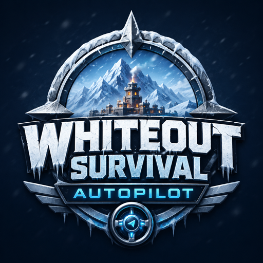
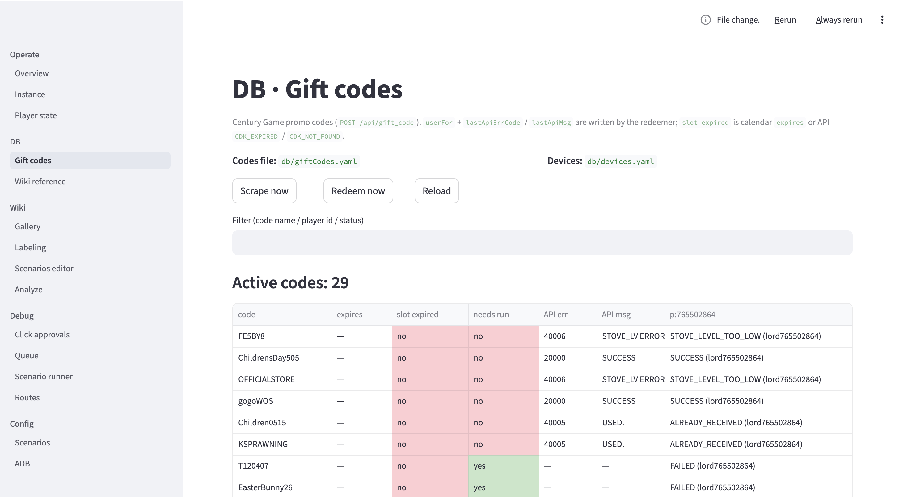
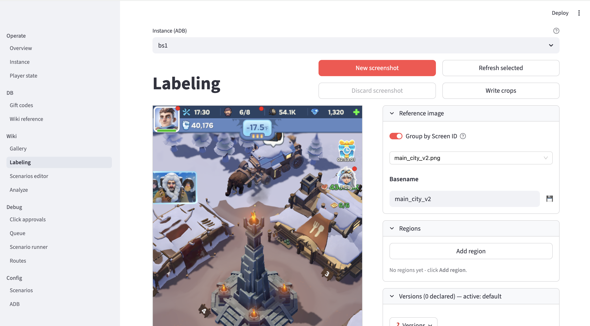
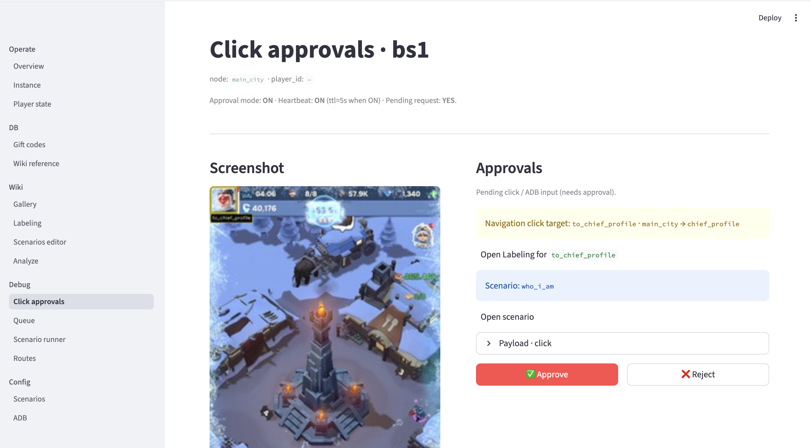

<p align="center">
  
</p>

# Whiteout Survival autopilot

Multi-account bot: one worker per BlueStacks instance, queue and state in Redis, screen text via a separate OCR HTTP service.

<p align="center">
  <a href="https://discord.gg/G8encVpD9"></a>
</p>

## ✨ Key Features

<div align="center">
  <i>Scenario-driven automation across the core daily loops.</i>
</div>

<br/>

<table>
<tr>
<td width="50%" valign="top">

<h3 align="center">⚔️ Combat & Events</h3>

| Feature | Description |
|:--------|:------------|
| **Squad Fight** | 12h cadence; re-deploys after every Victory until the squad finally loses |
| **Trials** | Claim trial rewards via the events flow |
| **Snowstorm** | Snowstorm event automation |
| **Event Blocks Scanner** | Detects and taps event tiles on the main city (4 slots) |
| **Arena** | Optional auto-check (disabled by default) |

</td>
<td width="50%" valign="top">

<h3 align="center">🏰 City Management</h3>

| Feature | Description |
|:--------|:------------|
| **Building Upgrades** | Pick the next upgrade and queue it through the build loop |
| **Furnace · Max Power** | Auto-tap the Max Power upgrade button |
| **Worker Assignment** | Auto-assign idle workers to open construction slots |
| **VIP · Daily** | Daily VIP login check |
| **Shop · Daily** | Auto-claim daily store rewards |

</td>
</tr>
<tr>
<td width="50%" valign="top">

<h3 align="center">🦸 Heroes</h3>

| Feature | Description |
|:--------|:------------|
| **Free Recruitments** | Daily claim of the free advanced/normal recruit (~5h) |
| **Hero Upgrades** | Auto-level and promote heroes |
| **Drain Red Dots** | Sweep every red dot on the heroes screen until clean |
| **Hero Unit Sync** | Sync hero unit data into local state |

</td>
<td width="50%" valign="top">

<h3 align="center">📦 Daily & Quality-of-Life</h3>

| Feature | Description |
|:--------|:------------|
| **Mail Gifts** | Read mail and claim all attached gifts |
| **Gift Code Hub** | Fetch + redeem the latest gift codes from the in-UI hub (per account) |
| **Ads · Auto-Claim** | Rookie Value Pack, Natalia, info popups |
| **Backpack** | Use resources, speedups, gear, bonuses on a schedule |
| **Overlay Dismissers** | Confirm / claim / box-gift / reconnect / tap-anywhere popups |
| **Onboarding Skipper** | Auto-dismiss hand-pointers, tutorial skip buttons, "where am I" prompts |
| **Chapter Tasks** | Chapter router pushes the right per-chapter scenario |
| **Exploration Rewards** | Claim exploration chests every ~4h |

</td>
</tr>
</table>

<br/>

<div align="center">

### ⚙️ Advanced Bot Capabilities

</div>

<br/>

<table>
<tr>
<td align="center" width="25%">
  <br/>
  
  <br/><br/>
  <sub>One worker per BlueStacks instance — accounts run in parallel, isolated by ADB serial</sub>
  <br/><br/>
</td>
<td align="center" width="25%">
  <br/>
  
  <br/><br/>
  <sub>Declarative scenarios: <code>match</code>, <code>click</code>, <code>while_match</code>, <code>ocr</code>, <code>cond</code>, <code>push_scenario</code></sub>
  <br/><br/>
</td>
<td align="center" width="25%">
  <br/>
  
  <br/><br/>
  <sub>Every tap can be approved in the UI before it fires — preview snapshot included</sub>
  <br/><br/>
</td>
<td align="center" width="25%">
  <br/>
  
  <br/><br/>
  <sub>Pending + history + state in Redis — restart-safe, visible from Streamlit</sub>
  <br/><br/>
</td>
</tr>
<tr>
<td align="center" width="25%">
  <br/>
  
  <br/><br/>
  <sub>Template + OCR + red-dot + tab-active + white-border detectors with per-rule gates</sub>
  <br/><br/>
</td>
<td align="center" width="25%">
  <br/>
  
  <br/><br/>
  <sub>Capture references over ADB and label OCR regions directly in the browser</sub>
  <br/><br/>
</td>
<td align="center" width="25%">
  <br/>
  
  <br/><br/>
  <sub>Screen text via a separate OCR HTTP service (PaddleOCR in <code>docker compose</code>)</sub>
  <br/><br/>
</td>
<td align="center" width="25%">
  <br/>
  
  <br/><br/>
  <sub>Interval-driven scenarios publish immediately on boot, then throttle by interval</sub>
  <br/><br/>
</td>
</tr>
</table>

<br/>

---

## 🎬 Showcase & Media

<div align="center">

<details>
<summary><b>📸 Screenshots — Click to expand</b></summary>
<br/>

The Streamlit app (`uv run wos`) covers gift codes, labeling/YAML scenarios, and runtime scenario debugging.

| | |
|:---:|:---:|
|  |  |
|  | |

</details>

</div>

<br/>

---

<br/>

## 🐳 Quickstart with Docker (no local toolchain)

> [!TIP]
> Easiest path if you just want to **run** the bot. Pre-built images live on
> GitHub Container Registry — no Python / uv / paddleocr install needed.

<br/>

### Prerequisites

| Requirement | Purpose |
|:-----------|:--------|
| **Docker Desktop** (macOS/Windows) or Docker Engine + Compose v2 (Linux) | Runs the three services |
| **BlueStacks 5+** with ADB enabled on the host | The bot drives the emulator |
| **`adb`** on the host, with the emulator visible in `adb devices` | Container talks to the host's ADB server |

> [!IMPORTANT]
> Emulator must be **720 × 1280, 320 DPI, English game language** — see [📱 Emulator Configuration](#-emulator-configuration) below.

<br/>

### Run

```sh
# Clone the repo (just for the compose files + config templates)
git clone https://github.com/batazor/whiteout-survival-autopilot.git
cd whiteout-survival-autopilot

# Make sure the host's ADB server is up and your emulator is visible
adb start-server
adb devices

# Pull and start: redis + ocr + bot
docker compose -f docker-compose.prod.yml up -d

# UI on http://127.0.0.1:8501
open http://127.0.0.1:8501
```

| Service | Image | Notes |
|:--------|:------|:------|
| `bot` | `ghcr.io/batazor/whiteout-survival-autopilot/bot:latest` | Worker + scheduler + Streamlit UI. Multi-arch (amd64+arm64). |
| `ocr` | `ghcr.io/batazor/whiteout-survival-autopilot/ocr:latest` | PaddleOCR HTTP API. amd64 only (no paddlepaddle arm64 wheel for py3.13 yet). |
| `redis` | `redis:alpine` | Queue + state. |

<details>
<summary><b>📌 Pin a specific version (recommended for stability)</b></summary>
<br/>

```sh
WOS_IMAGE_TAG=v0.1.0 docker compose -f docker-compose.prod.yml up -d
```

Available tags: `latest` (HEAD of `main`), `sha-<short>` (per commit), `vMAJOR.MINOR.PATCH` (releases), `MAJOR.MINOR` (rolling minor).

</details>

<details>
<summary><b>🐧 Native Linux notes</b></summary>
<br/>

`host.docker.internal` resolves on Docker Desktop but not on native Linux Docker. Edit `docker-compose.prod.yml`:

- Remove the `ports:` and `extra_hosts:` blocks under `bot`
- Uncomment `network_mode: host`
- Change `ADB_SERVER_SOCKET` to `tcp:127.0.0.1:5037`

Or run with `--network=host` directly: `docker run --rm --network=host ghcr.io/batazor/whiteout-survival-autopilot/bot:latest`.

</details>

<details>
<summary><b>🔍 Logs & troubleshooting</b></summary>
<br/>

```sh
docker compose -f docker-compose.prod.yml logs -f bot     # worker + UI
docker compose -f docker-compose.prod.yml logs -f ocr     # paddleocr
docker compose -f docker-compose.prod.yml ps              # status + healthchecks
```

If the bot can't see the emulator: confirm `adb devices` works on the host first, then check `docker exec wos-bot adb devices` inside the container. The serial in `db/devices.yaml` must match.

</details>

<br/>

---

<br/>

## 🛠️ Installation & Setup (build from source)

> [!NOTE]
> The bot ships as a single Python app run via [uv](https://docs.astral.sh/uv/). UI and worker run in one Streamlit process by default. Use this path if you want to edit code locally.

<br/>

### 1️⃣ Prerequisites

<div align="center">

| Requirement | Version | Download |
|:-----------:|:-------:|:--------:|
|  | latest | **[Install uv](https://docs.astral.sh/uv/getting-started/installation/)** |
|  | `3.13` (pinned by `.python-version`) | _auto-installed by uv_ |
|  | `compose v2` | **[Get Docker](https://docs.docker.com/get-docker/)** |
|  | `7+` | _started via `docker compose`_ |
|  | latest | **[Download ADB](https://developer.android.com/tools/releases/platform-tools)** |
|  | `5` or newer | **[Download BlueStacks](https://www.bluestacks.com/)** |

</div>

<details>
<summary><b>💡 macOS / Linux / Windows: making sure <code>adb</code> is on PATH</b></summary>
<br/>

Streamlit (and Cursor) often start with a reduced `PATH`. The UI defaults to `/opt/homebrew/bin/adb` (Homebrew on Apple Silicon); autodiscovery also checks `~/Library/Android/sdk/platform-tools/adb` and `/usr/local/bin/adb`.

Override either of:

- `ANDROID_HOME=/path/to/sdk`
- `worker.adb_executable: /full/path/to/adb` in `config/settings.yaml`

Verify:

```sh
adb devices
```

The serial column must match `bluestacks_window_title` in `config/settings.yaml`.

</details>

<br/>

### 2️⃣ Setup

```sh
# Clone the repository
git clone https://github.com/batazor/whiteout-survival-autopilot.git
cd whiteout-survival-autopilot

# Install Python 3.13 + project deps (from uv.lock)
uv sync

# Start Redis + PaddleOCR
docker compose up -d redis ocr
```

> [!TIP]
> Edit `config/settings.yaml` (`redis.url`, `ocr.url`, `instances`) and `db/devices.yaml` (players per device) before the first run.

<br/>

### 3️⃣ Running the Bot

```sh
# UI + worker + scheduler — all in one process
uv run wos
```

> [!IMPORTANT]
> Keep BlueStacks running and the device visible in `adb devices` before the worker starts. Streamlit serves at [http://127.0.0.1:8501](http://127.0.0.1:8501) (override with `WOS_STREAMLIT_PORT=8502`).

<details>
<summary><b>🔧 Headless mode (separate worker + scheduler processes)</b></summary>
<br/>

```sh
uv run wos-bot
# or
uv run python -m worker.supervisor
```

The UI publishes commands on `wos:ui:command:{instance_id}` and `wos:ui:command:scheduler`; both modes read the same Redis state.

</details>

<details>
<summary><b>🧪 Dev tools</b></summary>
<br/>

```sh
uv sync --extra dev
```

</details>

<br/>

---

<br/>

## 📱 Emulator Configuration

<div align="center">
  <i>The bot interfaces with your Android emulator via ADB. Officially supported:</i>
  <br/><br/>

  <a href="#-emulator-configuration"></a>
</div>

<br/>

### Required Instance Settings

<div align="center">

| Setting | Value | Status |
|:-------:|:-----:|:------:|
| **Resolution** | `720 × 1280` (Portrait) | 🔴 **Mandatory** |
| **DPI** | `320` | 🔴 **Mandatory** |
| **Game Language** | English | 🔴 **Mandatory** |
| **ADB** | Enabled (Advanced settings → Android Debug Bridge) | 🔴 **Mandatory** |
| **ADB Serial** | Matches `bluestacks_window_title` in `config/settings.yaml` | 🔴 **Mandatory** |
| **CPU / RAM** | 2 Cores / 2 GB | 🟡 Recommended |
| **Frame Rate** | 30 FPS | 🟡 Recommended |

</div>

> [!TIP]
> In the game's settings, disable *Snowfall* and *Day/Night Cycle*, and avoid *Ultra* graphics. This considerably improves performance and visual reliability for the bot.
