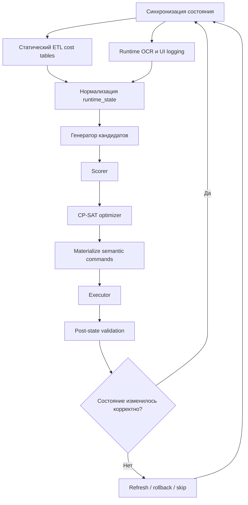

# Ресурсный оптимизатор прокачки Gen1-героев Whiteout Survival на базе OR-Tools

## Краткое резюме

Для этой задачи оптимальная архитектура — не day-based скрипт и не “жёсткий priority list”, а ресурсно-управляемый контур из четырёх частей: статические таблицы стоимости, runtime-захват UI и OCR для динамических значений, доменный scorer и целочисленный оптимизатор на базе OR-Tools CP-SAT. Это важно потому, что ключевые кривые стоимости в игре нелинейны: полный звёздный путь героя от 1★ до max требует 1 065 осколков, при этом одна только полоса 5★ стоит 600; exclusive gear использует отдельную валюту widgets, а community-таблица, на которую ссылается официальная вики, даёт лестницу 5, 10, 15, …, 50 widgets по уровням weapon 1–10, всего 275 widgets. citeturn6view6turn6view5turn7view0

Ценность прокачки в Gen1 нельзя задавать одним глобальным tier-list. Официальные режимные гайды расходятся по приоритетам в зависимости от режима: для F2P expedition ядром рекомендуются Molly/Sergey/Bahiti, для F2P exploration и arena — Sergey/Jessie впереди и Molly/Bahiti/Gina сзади, а Bear Hunt радикально повышает ценность joiner-героев с первым Expedition Skill, прежде всего Jessie и Jasser. Следовательно, `hero_meta` должен хранить веса по режимам, а scorer — оценивать апгрейды mode-by-mode, а не “в среднем по аккаунту”. citeturn18view1turn18view0turn14view0turn6view9

Ресурсные правила должны жёстко защищать gems, widgets и general shards. Официальный Shop Guide прямо рекомендует сохранять ценность gems под Lucky Wheel, а официальный Lucky Wheel guide показывает фиксированную экономику 1 spin = 1 500 gems, 10 spins = 13 500 gems, причём при 120 spins × 6 циклов ожидается примерно 1 083.6 shard — это уже больше, чем 1 065 shard, нужных для полного max star path wheel-героя. Для F2P это означает, что gem reserve — не “мелкая эвристика”, а первичный ресурсный constraint. citeturn16view0turn25view0turn6view6

С инженерной точки зрения CP-SAT здесь уместнее простого MIP-wrapper или чистого greedy: модель полностью целочисленная, состоит из дискретных next-step действий, должна учитывать multi-resource capacities, prefix-dependencies и if/then-правила вида `stop_if_unlocked`. Документация OR-Tools рекомендует CP-SAT именно для integer-only моделей, требует целочисленные коэффициенты в objective/constraints и отдельно демонстрирует упаковочные паттерны knapsack/multiple knapsack и обязательность time limits для практического продакшена. citeturn10view0turn10view2turn10view1turn22search0turn23search2

| Что стоит заложить сразу | Почему это эффективно |
|---|---|
| Семантический YAML DSL для команд | Позволяет менять solver backend без переписывания бота |
| Static tables + runtime OCR | Закрывает и стабильные, и серверно-вариативные стоимости |
| Score-first, optimize-second | OR-Tools выбирает набор, но не знает доменную ценность сам по себе |
| Only next-step candidates | Сильнее контролирует нелинейные cost curves и уменьшает search space |
| Re-optimize after each executed action | После каждого апгрейда меняются affordability и marginal ROI |

## Источники данных и извлечение таблиц стоимости

Базовую иерархию источников я рекомендую задать так.

1. **S1 — официальная вики игры: urlWhiteout Survival Wikiturn15search6.** Это главный источник для feature gates, поколений героев, линий режимной игры, Drill Camp, Lucky Wheel, Hero Gear и shop/event mechanics. Именно S1 должен быть “зонтиком доверия” для всего проекта. citeturn15search6turn25view0turn26view0turn6view5turn16view0

2. **S2 — gear-таблица, на которую ссылается официальная вики: urlHero Gear spreadsheetturn7view0.** Она особенно ценна тем, что даёт именно числовой ETL-материал: enhancement point cost per level, sacrifice yields, mastery level bonuses и widget ladder для exclusive gear. Для gear XP и widgets это должен быть основной табличный источник. citeturn6view5turn7view0

3. **S3 — community guide по осколкам: urlHeaven Guardian shards guideturn0search0.** Для star-tier costs это самый полезный компактный источник: он публикует полную shard ladder 1★→5★ и прямо подчёркивает нелинейность поздних tiers и высокую ценность general mythic shards. citeturn6view6

4. **S4 — community mode-guides: urlOut of Games Bear Hunt guideturn14view0 и urlOut of Games heroes guideturn2search0.** Эти материалы полезны не столько как cost tables, сколько как input для hero role modeling, особенно для Bear joiners, overwrite-механики и F2P/early acquisition контекста. citeturn14view0turn6view0

5. **S5 — secondary numeric sources: urlWhiteout Data Hero XP chartturn8view0 и urlOne Chilled Gamer hero guideturn8view1.** S5 стоит использовать как secondary bootstrap для hero XP по уровням и для некоторых rule dependencies, например ограничения skill max level по star level. Это не должен быть единственный источник истины, но это хороший стартовый seed для `hero_xp_v*` и validation checks. citeturn8view0turn8view1

6. **S6 — runtime OCR / UI logging.** Для dynamic costs этот слой должен стать источником истины: skill manual costs по конкретному skill level, мгновенные affordability checks, shop inventory/prices, а также серверно-зависимые exchange tables. Прямое основание для этого — то, что официальные страницы хорошо покрывают currencies и принципы, но не дают полного versioned machine-readable matrix по manual costs и shop pricing; при этом Tundra Trading Station прямо отмечает, что rewards vary by server. citeturn17search0turn17search1turn17search3turn16view1turn16view0

7. **S7 — русскоязычные sanity-check материалы, например urlAppTime guide on hero gearturn12search10.** Их полезно держать как локализованный словарь терминов для UI/OCR и для ручной сверки терминологии, но не как canonical numeric ETL: структурированные числа по gear/shards/widgets всё равно лучше брать из S1–S2. citeturn12search10turn6view5turn7view0

Ниже — приоритизация по каждому виду таблиц.

| Семейство стоимости | Primary | Secondary | Runtime authoritative | Что реально извлекать |
|---|---|---|---|---|
| Hero XP per level | S5 | S1 | S6 fallback | `hero_xp_v*`, gates по Furnace |
| Skill book costs | S6 | S1, S4, S5 | Да | `skill_manual_costs_v*` по rarity/track/slot/level |
| Gear XP / enhancement points | S2 | S1 | Только для sanity check | `gear_points_v*`, sacrifice yields |
| Shard costs per star tier | S3 | S1 hero pages | Нет, если не меняется | `star_tiers_v1` |
| Widgets / exclusive gear | S2 | S1 | S6 для shop affordability | `exclusive_widgets_v*` |
| Gems / wheel economics | S1 | S6 | Да для shop/event states | `lucky_wheel_v*`, gem reserve rules |
| Server-dependent exchange value | S6 | S1 event pages | Да | `event_exchange_v*` |

Из этого следует простое разделение: **static ETL** хранит `hero_xp`, `star_tiers`, `gear_points`, `exclusive_widgets`, `lucky_wheel`; **dynamic ETL** через OCR/logging хранит `skill_manual_costs`, `shop inventories`, `gem-denominated action costs`, `event exchange tables` и все affordability snapshots. Это особенно важно из-за серверной вариативности Tundra и из-за того, что официальные shop pages дают приоритеты покупок, а не полный болт-зе-болт price catalog. citeturn16view1turn16view0turn25view0

## Модель данных и YAML DSL

Для стартового F2P-профиля я бы один раз зафиксировал такие доменные priors: entity["fictional_character","Молли","whiteout survival"] — основной carry для exploration/arena и часть F2P expedition core; entity["fictional_character","Сергей","whiteout survival"] — ранний frontline-tank и единственный SR tank в раннем expedition core; entity["fictional_character","Бахити","whiteout survival"] — ранний marksman core для expedition; entity["fictional_character","Джесси","whiteout survival"] — dual-role герой для exploration и Bear join; entity["fictional_character","Джина","whiteout survival"] — exploration/beast utility; entity["fictional_character","Джассер","whiteout survival"] — почти чистый Bear-joiner; entity["fictional_character","Зинман","whiteout survival"] — Gen1 wheel-герой, но не must-have F2P combat carry; а entity["fictional_character","Флинт","whiteout survival"] и entity["fictional_character","Алонсо","whiteout survival"] формируют первую серьёзную волну replacement pressure в Gen2. Эти priors опираются на F2P lineups, Bear joiner mechanics, skill-order guide и график поколений. citeturn18view1turn18view0turn14view0turn6view9turn6view8turn25view0

Feature gates обязательно нужно хранить в runtime state как first-class поля: Drill Camp открывается на Furnace 13 и позволяет вручную качать только пять instructor-героев, Hero Gear открывается после Furnace 15, Mastery Forging — при Furnace 20 и gear level 20, а Gen2 приходит примерно на 40-й день с небольшой вариативностью. Это не “текстовая справка”, а реальные legal gates для команд `level_up`, `gear_assign`/`gear_enhance`, `stop_if_unlocked` и replacement penalty. citeturn26view0turn24search4turn6view5turn6view8turn25view0

| Блок модели | Поля, которые должны быть в runtime state | Зачем это solver’у |
|---|---|---|
| Account context | `server_age_days`, `furnace_level`, `drill_camp_unlocked`, `hero_gear_unlocked`, `mastery_unlocked`, `current_gen`, `current_wheel_hero`, `profile_id` | Даёт legal gates и replacement horizon |
| Resources | `hero_xp`, `rare/epic/mythic_general_shards`, `specific_shards_by_hero`, `exploration_manuals_by_rarity`, `expedition_manuals_by_rarity`, `enhancement_xp`, `essence_stones`, `widgets_by_hero`, `gems`, `event_vouchers`, `mystery_badges` | Это capacities в CP-SAT |
| Heroes | `unlocked`, `level`, `star_level`, `star_tier`, `skills`, `gear_state`, `exclusive_gear_level`, `current_role_tags`, `manual_instructor`, `in_drill_slot` | Нужно для candidate generation и legality |
| Shops / events | `lucky_wheel_active`, `wheel_tickets`, `mystery_shop_inventory`, `tundra_inventory`, `bear_window_active` | Нужно для gem rules и contextual commands |
| ETL quality | `cost_table_version`, `last_seen_at`, `ocr_confidence`, `provenance` | Нужно для confidence gating и replayability |

| `hero_meta` поле | Смысл | Пример использования |
|---|---|---|
| `role_tags` | `core`, `joiner_only`, `dual_role_support`, `wheel_path`, `economy_leaning` | Ограничивает XP/gears и general shards |
| `mode_weights` | Вес героя по `expedition`, `exploration`, `arena`, `bear_join` | Формирует `base_value` |
| `skill_priority` | Порядок навыков по типу режима | Формирует `skill_up` candidates |
| `replacement_risk_curve` | Риск замены по горизонту поколений | Штрафует поздние sunk-cost upgrades |
| `sunkness_by_action` | Насколько необратима инвестиция | Level < skill < shards < widgets |
| `manual_level_policy` | `manual_level_cap_pre_drill`, `manual_level_cap_post_drill` | Убирает лишний XP from joiners |
| `general_shard_policy` | `deny`, `allow_until_star`, `allow_if_blocked` | Разрешает profile-based shard usage |
| `stop_rules` | Условия прекращения deep investment | `Sergey` after `Flint`, etc. |

### Формат `cost_table.yaml`

Ниже — минимальный, но практичный формат cost tables. Он опирается на S2/S3/S5/S1 для статических лестниц и на S6 для dynamic costs. Важно, что skill-level constraints должны учитывать зависимость max skill level от star level, а значит `star_tier_up` и `skill_up` связаны dependency edge’ами. citeturn7view0turn6view6turn8view0turn8view1

```yaml
cost_tables:
  hero_xp_v2026_05:
    unit: hero_xp
    max_level: 80
    furnace_gates:
      20: 4
      21: 10
      23: 11
      26: 12
      29: 13
      32: 14
      35: 15
      38: 16
      41: 17
      44: 18
      47: 19
      50: 20
      55: 21
      60: 22
      65: 23
      70: 24
      75: 25
      80: 26
    per_level:
      2: 480
      3: 690
      4: 920
      5: 1200
      10: 3100
      20: 13000
      30: 24000
      40: 58000
      50: 130000
      60: 300000
      70: 770000
      80: 2400000

  star_tiers_v1:
    unit_by_rarity:
      rare: rare_shard
      epic: epic_shard
      mythic: mythic_shard
    tiers:
      1: [1, 1, 2, 2, 2, 2]
      2: [5, 5, 5, 5, 5, 15]
      3: [15, 15, 15, 15, 15, 40]
      4: [40, 40, 40, 40, 40, 100]
      5: [100, 100, 100, 100, 100, 100]
    total_1_to_max: 1065

  gear_points_v2026_05:
    unit: enhancement_points
    per_level:
      1: 10
      2: 15
      3: 20
      4: 25
      5: 30
      6: 35
      7: 40
      8: 45
      9: 50
      10: 55
      20: 105
      30: 160
      40: 270

  exclusive_widgets_v2026_05:
    unit: widget
    per_level:
      1: 5
      2: 10
      3: 15
      4: 20
      5: 25
      6: 30
      7: 35
      8: 40
      9: 45
      10: 50
    total_to_10: 275

  lucky_wheel_v2026_05:
    gems_per_spin: 1500
    gems_per_10_spin: 13500
    expected_shards_per_120: 180.592
    expected_shards_per_120x6: 1083.552
    wheel_heroes:
      gen1: zinman
      gen2: flint
      gen3: mia

  runtime_ocr_skill_manuals:
    source: runtime_ocr
    key_fields: [hero_id, track, rarity, skill_slot, from_level]
    confidence_min:
      low_value_actions: 0.85
      high_value_actions: 0.93
```

### Минимальная схема команд DSL

Семантическая команда должна быть отделена от UI-реализации. Оптимизатор выбирает **что** делать, а executor уже знает **как** нажимать экран или API. Ключевой принцип — каждая команда должна ссылаться на `cost_ref`, `preconditions`, `score_ref` и `stop/refusal rules`. Это особенно важно потому, что цены растут нелинейно, часть апгрейдов необратима, а level-up частично обратим через Drill Camp reset. citeturn6view6turn26view0turn10view0

| Поле команды | Обязательно | Назначение |
|---|---|---|
| `id` | Да | Уникальный идентификатор и audit trail |
| `action` | Да | `level_up`, `skill_up`, `star_tier_up`, `gear_assign`, `resource_rules`, `stop_investment` |
| `hero` | Для hero-actions | Целевой герой |
| `selector` | Для rules | Выбор по тегам / группе героев |
| `cost_ref` | Для spend actions | Отсылка к table + runtime key |
| `preconditions` | Да | Проверка unlocks, caps, afford, profile |
| `score_ref` | Для optimized actions | Как считать ценность |
| `priority_band` | Желательно | Для tie-break и explainability |
| `postconditions` | Желательно | Проверка, что состояние реально изменилось |
| `cooldown_policy` | Опционально | Например, для reset/slot logic |
| `diagnostics` | Желательно | Почему команда выбрана или отвергнута |

### Примеры команд

Ниже — набор конкретных примерных команд, покрывающий все action types из требований. Он опирается на режимные приоритеты, Drill Camp, Bear joiner mechanics, Lucky Wheel economics и gear rules. citeturn18view1turn18view0turn14view0turn26view0turn25view0turn6view5

```yaml
dsl_version: 1

resource_rules:
  - id: reserve_gems_for_next_wheel
    action: resource_rules
    resource: gems
    policy: reserve_min
    amount_ref: cost_tables.lucky_wheel_v2026_05.gems_per_10_spin
    when:
      all:
        - spender: false
        - server_age_days_lt: 40
        - wheel_policy: reserve_for_next_gen

  - id: prefer_specific_shards_before_general
    action: resource_rules
    resources: [epic_general_shard, mythic_general_shard]
    policy: specific_first_general_second

  - id: no_manual_xp_for_joiner_only_after_drill
    action: resource_rules
    selector:
      tags_any: [joiner_only]
    policy:
      manual_level_cap_pre_drill: 10
      manual_level_cap_post_drill: 0

  - id: deny_gems_for_drill_reset_cooldown
    action: resource_rules
    resource: gems
    policy: deny_for_level_reset_cooldown

stop_investment:
  - id: stop_jasser_after_bear_threshold
    action: stop_investment
    hero: jasser
    applies_to: [level_up, star_tier_up, gear_assign]
    when:
      all:
        - skill_reached:
            track: expedition
            slot: 1
            level: 5
        - hero_has_tag: joiner_only

  - id: stop_sergey_deep_sinks_after_flint
    action: stop_investment
    hero: sergey
    applies_to: [star_tier_up, gear_assign]
    when:
      hero_unlocked: flint

commands:
  - id: molly_level_next
    action: level_up
    hero: molly
    cost_ref:
      table: hero_xp_v2026_05
      key:
        from_level_ref: state.heroes.molly.level
    preconditions:
      - hero_unlocked: molly
      - below_level_cap_ref: state.account.hero_level_cap
      - resource_gte_ref:
          hero_xp: resolved_cost.hero_xp
    score_ref:
      scorer: default_weighted
      modes: [exploration, arena, expedition]
    priority_band: core

  - id: jessie_expedition_skill_1_next
    action: skill_up
    hero: jessie
    skill_track: expedition
    skill_slot: 1
    target_rule: until_level_5
    cost_ref:
      table: runtime_ocr_skill_manuals
      key:
        hero: jessie
        track: expedition
        rarity: epic
        skill_slot: 1
        from_level_ref: state.heroes.jessie.skills.expedition.1
    preconditions:
      - hero_unlocked: jessie
      - skill_below_target: 5
      - resource_gte_ref:
          epic_expedition_manual: resolved_cost.epic_expedition_manual
    score_ref:
      scorer: threshold_aware
      threshold_bonus:
        skill_level_5: 2500
      modes: [bear_join, expedition]
    priority_band: threshold

  - id: molly_star_next
    action: star_tier_up
    hero: molly
    shard_policy: specific_first_general_if_allowlisted
    cost_ref:
      table: star_tiers_v1
      key:
        star_level_ref: state.heroes.molly.star_level
        tier_ref: state.heroes.molly.star_tier
        rarity: mythic
    preconditions:
      - hero_unlocked: molly
      - resource_gte_any:
          mythic_specific_shard: resolved_cost.mythic_shard
          mythic_general_shard: resolved_cost.mythic_shard
      - allowlist_passed:
          resource: mythic_general_shard
          hero: molly
    score_ref:
      scorer: default_weighted
      modes: [exploration, arena, expedition]
    priority_band: long_term_core

  - id: bear_swap_best_marksman_gear_to_bahiti
    action: gear_assign
    hero: bahiti
    policy: best_available_marksman_set
    source_priority: [bahiti, gina]
    preconditions:
      - furnace_gte: 15
      - event_active: bear_hunt
    score_ref:
      scorer: contextual_assign
      modes: [bear_join, expedition]
    priority_band: context

  - id: sergey_star_next
    action: star_tier_up
    hero: sergey
    shard_policy: specific_first_general_if_allowlisted
    cost_ref:
      table: star_tiers_v1
      key:
        star_level_ref: state.heroes.sergey.star_level
        tier_ref: state.heroes.sergey.star_tier
        rarity: epic
    preconditions:
      - hero_unlocked: sergey
      - resource_gte_any:
          epic_specific_shard: resolved_cost.epic_shard
          epic_general_shard: resolved_cost.epic_shard
      - not_blocked_by_stop_rule: stop_sergey_deep_sinks_after_flint
    score_ref:
      scorer: default_weighted
      modes: [exploration, expedition]
    priority_band: core
```

### Пример последовательностей для стартового F2P-аккаунта

Здесь важно показать две profile-модели, потому что источники по general shards расходятся: один exploration guide допускает раннее использование general shards на Molly/Sergey/Bahiti, тогда как более свежий shard guide советует сохранять general mythic shards для действительно long-term героев. Значит, правильно не “выбрать одну истину”, а зашить policy switch. citeturn18view0turn6view6

**Консервативный long-term F2P-профиль**

```yaml
sequence_id: f2p_gen1_conservative_opening
profile:
  objective_weights:
    expedition: 35
    exploration: 30
    arena: 20
    bear_join: 15
  wheel_policy: reserve_for_next_gen
  general_shard_policy:
    mythic:
      mode: deny_by_default
      allow_heroes: []
    epic:
      mode: allow_core_only
      allow_heroes: [sergey, bahiti, jessie]

apply_order:
  - reserve_gems_for_next_wheel
  - prefer_specific_shards_before_general
  - no_manual_xp_for_joiner_only_after_drill
  - molly_level_next
  - sergey_level_next
  - bahiti_level_next
  - jessie_expedition_skill_1_next
  - jasser_expedition_skill_1_next
  - sergey_exploration_skill_2_next
  - molly_exploration_skill_1_next
  - assign_best_set_to_molly
  - assign_best_tank_set_to_sergey
  - stop_jasser_after_bear_threshold
  - stop_sergey_deep_sinks_after_flint
```

**Агрессивный opening-профиль**

```yaml
sequence_id: f2p_gen1_aggressive_opening
profile:
  objective_weights:
    expedition: 30
    exploration: 35
    arena: 20
    bear_join: 15
  wheel_policy: current_gen_if_blocked_progress
  general_shard_policy:
    mythic:
      mode: allow_threshold_only
      allow_heroes:
        molly:
          max_star: 3
    epic:
      mode: allow_core_only
      allow_heroes: [sergey, bahiti, jessie, gina]

extra_rules:
  - id: jessie_level_as_dual_role_support
    action: level_up
    hero: jessie
    enabled_when:
      all:
        - core_trio_avg_level_gte: 0.8 * state.account.hero_level_cap
        - jessie_in_active_exploration_lineup: true
```

## Модель scoring

Score-методы в такой системе обязательны: CP-SAT умеет выбирать оптимальный набор действий только после того, как вы превратили доменную ценность каждого действия в целые коэффициенты objective. Документация OR-Tools прямо говорит, что CP-SAT работает только с integer coefficients; кроме того, mode-specific game-guides показывают, что ценность одного и того же апгрейда резко меняется между expedition, exploration, arena и Bear join. citeturn10view0turn10view3turn18view1turn18view0turn14view0

Базовую формулу я рекомендую такой:

```text
mode_value(cmd, m) =
    profile_weight(m)
  * hero_mode_weight(hero, m)
  * upgrade_gain(cmd, m)
  * urgency_multiplier(cmd, m)

base_value(cmd) = sum(mode_value(cmd, m) for m in active_modes)

replacement_penalty(cmd) =
    replacement_risk(hero, horizon)
  * sunkness(action, resource_type)
  * proximity_to_next_gen(server_age_days)

resource_rarity_penalty(cmd) =
    sum(
      scarcity_weight(r) * cost_r(cmd) / max(1, spendable_r)
      for each resource r
    )

final_score(cmd) =
    max(0, base_value(cmd) - replacement_penalty(cmd) - resource_rarity_penalty(cmd))

cp_sat_value(cmd) = round(final_score(cmd) * 100)
```

Ключевое место здесь — `upgrade_gain(cmd, m)`. В продакшене его лучше считать не “по абстрактному приоритету”, а по типу апгрейда. Для `level_up` это может быть дельта статов и capacity; для `skill_up` — дельта эффекта навыка плюс discrete threshold bonuses; для `star_tier_up` — stat gain плюс бонус за открытие нового skill cap; для `gear_assign` — contextual gain активного lineup. Связь `star_tier_up -> skill cap` критична, потому что максимальный skill level зависит от star level, следовательно skill candidates не должны генерироваться в отрыве от star state. citeturn8view1turn25view0turn14view0

Самый важный discrete bonus в Gen1 — Bear join threshold. Joiner players влияют на rally только первым Expedition Skill первого героя, причём учитываются лишь четыре joiner-buffs, а joiner с более высоким skill level может overwrite более слабого. Поэтому достижение **skill level 5** для первого expedition skill у Jessie/Jasser/Seo-yoon — это не линейный прирост, а отдельный шаг функции полезности, который scorer обязан моделировать как threshold bonus, а не как “ещё +1 уровень”. citeturn14view0turn6view3

Я бы рекомендовал следующие стартовые коэффициенты sunkness и scarcity как **доменные defaults**, а не как догму:

| Ресурс / действие | Sunkness | Почему |
|---|---:|---|
| `level_up` до Drill Camp | 0.35 | XP ещё мало и reset неудобен |
| `level_up` после Drill Camp | 0.15 | Можно держать только 5 instructors и ресетить уровни |
| `skill_up` | 0.60 | Manual sink и прямого массового rollback нет |
| `star_tier_up` на specific shards | 0.80 | Частично компенсируется только будущими event exchanges |
| `star_tier_up` на general shards | 1.00 | Самый высокий opportunity cost |
| `gear_enhance` | 0.55 | Gear можно переставлять, но enhancement resources уже потрачены |
| `exclusive widgets` | 1.00 | Очень узкая и дорогая long-term валюта |
| `gems` при активном wheel reserve | 0.90–1.00 | Уводят прогресс от wheel path |

Эти defaults хорошо согласуются с источниками: Drill Camp делает XP заметно более обратимым, widgets официально описаны как отдельный редкий sink exclusive gear, а Shop Guide прямо советует приоритизировать widgets в Mystery Shop и не тратить gems в Gem Shop, сохраняя ценность под Lucky Wheel. citeturn26view0turn6view5turn16view0turn25view0

Отдельно стоит зашить **profile switch для general shards**. Это не роскошь, а необходимость, потому что источники по ранней Gen1-стратегии действительно расходятся.

| Профиль | Mythic general shards | Gems | Когда использовать |
|---|---|---|---|
| `conservative_long_term_f2p` | По умолчанию не тратить в Gen1 | Резерв под следующий wheel hero | Лучший default для F2P |
| `aggressive_opening_f2p` | Разрешить на Molly до breakpoints | Можно частично тратить на current wheel, но с reserve floor | Если цель — ускорить первый месяц |
| `bear_alliance_support` | Шарды в long-term core, manuals в Bear thresholds | Gems защищены ещё жёстче | Когда alliance KPI — Bear damage |

Такой переключатель логичнее жёсткого единственного правила, потому что official/community гайды одновременно показывают раннюю пользу core trio и долгосрочную ценность general mythic shards. citeturn18view0turn6view6turn16view0turn25view0

## Модель OR-Tools CP-SAT и генерация кандидатов

Модель CP-SAT я рекомендую строить не на “целевом состоянии героя”, а на **дискретных next-step действиях**. Это естественно для игры с нелинейными cost curves: следующий уровень, следующий skill level, следующий star tier, следующее widget level, следующая contextual gear assignment. Тогда каждая переменная — это бинарный выбор одной команды, а solver выбирает оптимальное подмножество в пределах доступных ресурсов. Такой паттерн полностью соответствует official knapsack / multiple-knapsack usage в OR-Tools и хорошо укладывается в integer-only objective CP-SAT. citeturn10view2turn10view1turn10view0

Минимальная формализация выглядит так:

```text
x_c ∈ {0,1}  for each candidate command c

maximize:
  Σ (cp_sat_value(c) * x_c)

subject to:
  Σ cost(c, hero_xp) * x_c <= spendable_hero_xp
  Σ cost(c, epic_expedition_manual) * x_c <= spendable_epic_expedition_manual
  Σ cost(c, mythic_general_shard) * x_c <= spendable_mythic_general_shard
  Σ cost(c, widget) * x_c <= spendable_widget
  Σ cost(c, gems) * x_c <= spendable_gems

  prefix constraints for multi-step chains
  legal gates from furnace / star / unlock state
  stop_if_unlocked / deny_general_shards_on
  manual_instructor limits after Drill Camp
```

Если вы генерируете не только “следующий уровень”, а небольшой horizon из нескольких уровней одного героя, обязательно добавляйте prefix constraints вида `x_lvl_41_42 <= x_lvl_40_41`. Для условных логик and/or channeling OR-Tools даёт стандартный механизм через reified constraints / `OnlyEnforceIf`; однако в online-режиме большинство hard rules проще и дешевле применять ещё на стадии candidate pruning. citeturn10view4turn10view0

Систему hard rules я бы задал так.

| Rule type | Как реализовать | Комментарий |
|---|---|---|
| Multi-resource capacities | Линейные ограничения по каждому ресурсу | Основа всей модели |
| `deny_general_shards_on` | Либо prune, либо `x_c = 0` по rule match | Лучше tag-based + profile-based |
| `support_level_cap` | Prune level candidates для `joiner_only`/`support` | Опирается на Bear mechanics + Drill Camp |
| `stop_if_unlocked` | Prune expensive sinks после unlock replacement hero | Особенно важно около Gen2 |
| `skill_cap_by_star` | Не генерировать illegal skill-up actions | Иначе будет шум в search space |
| `gem_reserve_floor` | Ограничение на spendable gems | Защищает wheel path |
| `widgets_allowlist` | Prune widget-consuming candidates вне allowlist | Снижает долгосрочный regret |

Важный нюанс: replacement rules лучше делать **по типу инвестиции**, а не по герою целиком. Например, для Sergey после Flint я бы по умолчанию запрещал новые `star_tier_up` и дорогие `gear_enhance`, но не обязательно банил бы бесплатные `gear_assign` или дешёвые levels, если Sergey временно ещё остаётся в active lineup. Это более реалистично, чем бинарное “герой выключен”. Такой градуированный stop-rule логичен на фоне того, что Gen2 приходит примерно на 40-й день и несёт более высокие статы, но точный server timing немного плавает. citeturn18view1turn6view8turn25view0

Для solver params в online контуре я бы использовал такой практический default:

| Параметр | Online default | Batch/planning default | Почему |
|---|---:|---:|---|
| `max_time_in_seconds` | 0.15–0.35 | 3–10 | OR-Tools рекомендует time limits |
| `num_search_workers` | 2–4 | 4–8 | Параллельный поиск повышает diversity |
| `random_seed` | фиксированный | фиксированный | Воспроизводимость |
| `use_lns` | off при маленьком search space | on при большом | Полезно для более крупных моделей |
| `log_search_progress` | off | optional | Меньше шума в проде |

Это чисто инженерная рекомендация поверх официальных возможностей OR-Tools: docs отдельно описывают time limits, а release notes — `num_search_workers` и LNS для diversification/parallel search. citeturn22search0turn23search2

Чтобы не раздувать search space, candidate generator стоит жёстко ограничивать.

| Эвристика | Как работает | Эффект |
|---|---|---|
| `next-step only` | Для skills/stars/widgets — только ближайший legal step | Сильно уменьшает ветвление |
| `k-level horizon` | Для levels генерировать максимум 1–3 шага вперёд | Позволяет CP-SAT собрать маленькие пачки |
| Threshold-aware expansion | Дополнительно раскрывать кандидаты, которые ведут к Bear skill 5 или к unlock нового skill cap | Не теряет важные jump points |
| Dominance pruning | Удалять кандидаты с <= score и >= cost того же класса | Очищает search space |
| Mode relevance filter | Убирать героев с почти нулевым весом в активном профиле | Не тратит solver budget |
| Replacement risk filter | Подрезать дорогие sunk-cost апгрейды возле Gen rollover | Уменьшает regret |
| OCR confidence gate | При низкой уверенности блокировать gems/widgets actions | Повышает безопасность |

Сравнение greedy и OR-Tools на этой задаче я бы сформулировал так.

| Критерий | Greedy scorer | OR-Tools CP-SAT |
|---|---|---|
| Скорость MVP | Очень высокая | Средняя |
| Простота дебага | Высокая | Средняя |
| Качество при 1 ресурсе | Часто достаточно | Отлично |
| Качество при 4–8 ресурсах | Быстро деградирует | Сильно лучше |
| Hard rules и зависимости | Неудобно | Естественно |
| Пакетные решения | Плохо | Сильная сторона |
| Нелинейные cost curves | Нужны хаки | Обрабатываются лучше |
| Explainability | Хорошая | Хорошая при нормальном diagnostics |
| Требования к quality данных | Средние | Высокие |

Это инженерный вывод из природы самой задачи: игра сочетает нелинейные shard/gear/wheel curves, mode-specific value и несколько scarce currencies, а OR-Tools как раз предназначен для integer subset selection под constraints. При этом Greedy всё ещё лучший путь к самому быстрому MVP. citeturn6view6turn7view0turn25view0turn10view0turn10view1

## Контур исполнения и преобразование решения в команды бота

Продакшн-контур должен быть **stateful и re-optimizing**. Нельзя один раз сгенерировать большую пачку команд и выполнить её вслепую: после каждой операции меняются доступные ресурсы, affordability и marginal ROI следующего шага, а часть данных вообще может приходить из OCR и server-dependent event screens. Это особенно критично для shard tiers, Lucky Wheel, Tundra и Drill Camp workflows. citeturn6view6turn16view1turn25view0turn26view0



На выходе solver должен возвращать не UI-макросы, а список **semantic command objects**. Затем materializer подставляет resolved costs, snapshot state и guards, после чего executor выполняет только **первую** или максимум небольшую пачку top commands, а затем система снова читает состояние и решает задачу заново. Этот режим “solve → execute one step → refresh → solve again” обычно устойчивее, чем длинные batch pipelines. citeturn10view0turn22search0turn6view6

| Выход solver’а | Во что маппится |
|---|---|
| `candidate_id` | `command.id` |
| `hero_id` | `command.hero` |
| `action_type` | `command.action` |
| `resolved_costs` | `command.cost_snapshot` |
| `objective_contribution` | `command.diagnostics.score` |
| `selected_constraints` | `command.diagnostics.reason_codes` |
| `event_context` | `command.preconditions` и `command.selector` |

Такой mapping особенно полезен для contextual команд. Пример: `gear_assign` сам по себе может быть бесплатным, но его нужно уметь материализовать как mode-aware действие; это оправдано тем, что Bear guide прямо рекомендует переставлять gear на корректных rally heroes, а gear joiner-героев в Bear вообще не влияет на общий rally buff. То есть для executor важна не только “кому надеть”, но и “в каком event-context это имеет смысл”. citeturn14view0

Практическое правило исполнения такое:

1. Считать runtime state.
2. Если OCR confidence ниже порога, блокировать high-value resource actions.
3. Сгенерировать only legal next-step candidates.
4. Просчитать score.
5. Запустить CP-SAT с коротким time limit.
6. Выполнить 1–3 top actions.
7. Повторить цикл.

## Валидация и дорожная карта реализации

### План тестирования

Сильный optimizer без симулятора почти всегда ломается об edge cases, поэтому тестовый контур должен быть отдельным артефактом, а не побочным эффектом executor’а.

| Слой теста | Что проверять |
|---|---|
| Unit tests | Парсинг static cost tables, OCR normalization, legality gates, scoring formulas |
| Property tests | Prefix constraints, monotonicity cost curves, reserve floors, no overspend |
| Constraint tests | `deny_general_shards_on`, `support_level_cap`, `stop_if_unlocked`, `skill_cap_by_star` |
| Replay tests | Повторение реальных игровых сессий и сравнение решений |
| Simulation tests | Модели scarcity / generation rollover / Bear-focused account |
| Executor integration | Команда выбрана → команда выполнена → состояние изменилось корректно |

### Сценарии симуляции

| Сценарий | Что должен показать optimizer |
|---|---|
| Fresh F2P, scarce XP | Core trio levels приоритетнее лишних support levels |
| Bear-focused alliance | Jessie/Jasser threshold skills растут раньше marginal core upgrades |
| Pre-Gen2 window | Ужесточается replacement penalty на Sergey/Bahiti deep sinks |
| Post-Drill Camp | Резко падает ценность manual XP на joiner-only heroes |
| Gem-poor account | Соблюдается wheel reserve, нет мелких gem leaks |
| OCR confidence drop | блокируются risky actions на widgets/gems/manuals |

### Метрики качества

| Метрика | Формула / смысл |
|---|---|
| `total_value` | Сумма objective contribution выбранных команд |
| `resource_utilization_r` | `spent_r / spendable_r` по каждому ресурсу |
| `reserve_violations` | Число нарушений floor/allowlist правил |
| `solver_latency_ms` | Время на solve phase |
| `greedy_gap` | `(cp_sat_value - greedy_value) / max(1, cp_sat_value)` |
| `regret_vs_greedy` | Потеря в итоговой ценности, если бы исполнили greedy вместо selected batch |
| `invalid_action_rate` | Доля команд, ставших illegal к моменту исполнения |
| `ocr_block_rate` | Как часто confidence gates блокируют дорогие действия |

### Дорожная карта реализации

| Milestone | Что входит | Оценка усилий |
|---|---|---|
| MVP scorer-first | Static tables, runtime state schema, greedy backend, semantic DSL, executor skeleton | 1–2 недели |
| Constraint-hardening | stop rules, profile system, legality gates, diagnostics | 0.5–1 неделя |
| OR-Tools backend | CP-SAT model, candidate pruning, tie-breaks, benchmarks vs greedy | 1–2 недели |
| Runtime OCR ingestion | Skill/shop/event parsers, confidence gating, provenance logging | 1–2 недели |
| Replay + simulation harness | Synthetic states, regressions, greedy-gap reporting, telemetry dashboards | 1–2 недели |
| Full automation | Contextual gear/formations, shopping extensions, long-run stability | 2–4 недели |

### Рекомендуемый порядок внедрения

Наиболее эффективная стратегия внедрения — **не** начинать сразу с полного CP-SAT + OCR + executor, а сначала заморозить data contracts и YAML DSL, затем поднять greedy backend на тех же командах, после этого добавить CP-SAT как альтернативный solver, и только потом включить dynamic OCR ingestion для manuals/shops/events. Такой порядок даёт быстрый MVP, но при этом не закрывает дорогу к более сильной оптимизации: scorer и DSL остаются общими, меняется только backend выбора команд. Это технически особенно удобно, потому что OR-Tools хорошо решает integer subsetting под constraints, но требует уже чистых и устойчивых данных. citeturn10view0turn10view1turn22search0turn16view1turn25view0

Итоговая рекомендация для вашего кейса такая: **сначала сделать resource-driven YAML DSL и scorer, затем минимум один месяц откатать greedy-MVP на replay/simulation, и только после стабилизации cost ingestion включить OR-Tools CP-SAT как production selector**. Для Whiteout Survival это самый рациональный путь, потому что ключевая сложность здесь не в самой математике оптимизации, а в корректном учёте режимной ценности героев, feature gates, server-dependent event tables и частично динамических цен через runtime UI. citeturn18view1turn18view0turn14view0turn16view1turn10view0