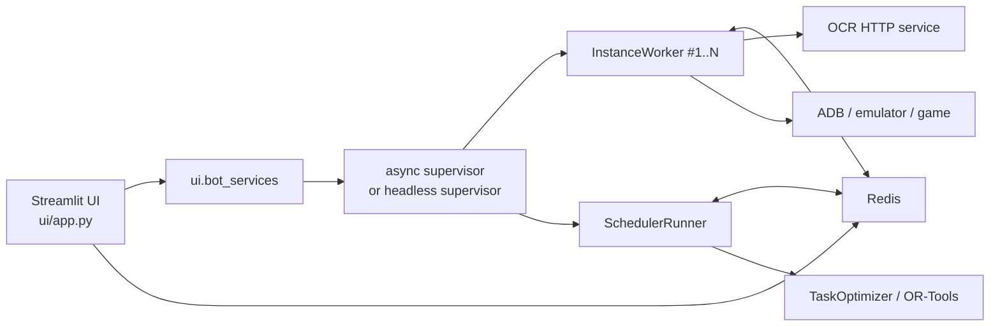

# Аудит проекта whiteout-survival-autopilot

## Краткое резюме

Я исследовал кодовую базу urlрепозиторияhttps://github.com/batazor/whiteout-survival-autopilot как бот для entity["video_game","Whiteout Survival","mobile game"] с мультиинстансной автоматизацией через entity["company","BlueStacks","android emulator vendor"], отдельным OCR-сервисом и хранением очередей/состояния в urlRedishttps://redis.io. По README и структуре дерева это зрелый по функционалу проект: один worker на инстанс, отдельный scheduler, YAML/DSL-сценарии, Streamlit UI, OCR-сервис, обширная папка `tests/`, локальный Streamlit-плагин и набор служебных модулей для навигации, overlay-анализа и конфигурации. При этом в публичном трекере сейчас нет открытых Issues и PR, а в Actions видны только GitHub-managed workflow’ы `Dependabot Updates` и `Dependency Graph`; явного CI, который гоняет тесты/линтеры проекта на push/PR, не видно. citeturn58view0turn14view1turn15view0turn59view0turn60view0

Мой главный вывод: архитектура функционально сильная, но в критичных местах слишком полагается на неявные глобальные контракты, фоновую координацию через Redis и “best effort” обработку ошибок. Это делает систему работоспособной в локальном dev-режиме, но повышает риск тихих сбоев, дублирования задач, crash-loop’ов и трудноуловимых состояний при hot reload / restart / потере ADB / частичных ошибках OCR. Наиболее важные проблемные зоны: повторная постановка одинаковых задач scheduler’ом, некорректное связывание OCR-ответов по порядку вместо `region_id`, небезопасная семантика сохранения `db/devices.yaml`, неоднозначное управление жизненным циклом embedded bot thread в UI и отсутствие защит от бесконечных перезапусков supervisor’а. citeturn38view0turn38view1turn45view5turn45view6turn55view2turn55view3turn39view4turn22view0

Полный end-to-end запуск я не смог честно воспроизвести в песочнице: проект требует Python 3.13, `uv`, `docker compose`, живой Redis, OCR-сервис, доступный `adb`, запущенный эмулятор, корректный `config/settings.yaml`, `db/devices.yaml` и фактически игровой аккаунт/устройство. README прямо указывает на эти требования и на необходимость совпадения ADB serial с `bluestacks_window_title`; код ADB-захвата дополнительно подтверждает, что типовой первый runtime failure — это “adb not found” или offline/missing device. citeturn58view0turn47view0turn46view0turn48view1turn48view2turn50view6turn51view10

Отдельно отмечу сильную сторону: стартовая валидация конфигурации уже проверяет важные runtime-инварианты — существование регионов/сценариев и корректность использования `has_red_dot`, чтобы типовые YAML-конфигурационные ошибки не превращались в “тихие no-op” в бою. Это хороший фундамент, который стоит расширять, а не переписывать. citeturn33view1turn33view4turn33view6

## Архитектура и структура проекта

По дереву репозитория проект разбит на доменные подсистемы: `capture`, `ocr`, `scheduler`, `optimizer`, `tasks`, `ui`, `worker`, `navigation`, `layout`, `config`, `gift`, `analysis`, `tests`, а также содержит локальный путь `streamlit-plugin/streamlit-drawable-canvas`. Это хороший признак модульности: интерфейсы по обязанностям отделены, а не свалены в один пакет. README подтверждает модель “один worker на инстанс BlueStacks, очередь/состояние в Redis, OCR через отдельный HTTP service”, а UI работает поверх Streamlit. citeturn57view0turn58view0

По исходникам orchestration выглядит так:



Эта схема высокоуровнево подтверждается README, `ui/app.py`, `ui/bot_services.py`, `worker.async_supervisor`, `scheduler.runner`, `worker.instance_worker` и `ocr.service`. citeturn58view0turn52view0turn39view0turn49view2turn38view1turn49view10turn45view0

Но у архитектуры есть и слабая сторона: важные части состояния сидят в глобалах и синглтонах. Это видно в `config.loader.get_settings()` через `_settings`, в `config.devices` через `_registry`, в `ui.bot_services` через `_started/_thread/_stop_event`, в `scheduler.ortools_executor` через `_pool`, а в headless supervisor — через `_shutdown`. Такая схема упрощает запуск, но ухудшает предсказуемость hot reload, graceful shutdown и изоляцию тестов. Для проекта с UI, воркерами, background thread и subprocess’ами это уже создает системный риск сопровождения. citeturn32view7turn55view4turn39view1turn39view4turn54view0turn54view2turn22view0

`worker.instance_worker.py` сам по себе собран из большого числа mixin’ов: screen detection, overlay, redis, rolling snapshots, task execution, health/UI helpers. Это позволяет раскладывать код по файлам, но фактически оставляет один центральный объект с очень широким набором обязанностей и скрытых runtime-инвариантов. С точки зрения maintainability это уже near-monolith, просто разрезанный mixin’ами. Для текущего размера системы я бы оценил модульность как “средне-хорошую”, а сопровождаемость как “ниже желаемой именно из-за orchestration-слоя”. citeturn49view5turn49view10turn50view10turn51view10turn32view6

## Сборка, запуск, тесты, CI и воспроизводимость

README хорошо описывает базовый путь запуска: `uv sync`, `docker compose up -d redis ocr`, затем `uv run wos`; также есть headless-режим через `uv run wos-bot` или `uv run python -m worker.supervisor`. Документация прямо указывает на Python 3.13, `uv`, `docker compose`, ADB и BlueStacks, а также на требование совпадения ADB serial с `bluestacks_window_title`. Это делает входной путь понятным, но одновременно объясняет, почему реальный runtime очень завязан на окружение. citeturn58view0turn56view3turn56view4

С точки зрения воспроизводимости багов ключевая проблема не в том, что инструкции отсутствуют, а в том, что для честного E2E-натива нужен внешний стэк: локальный Redis, локальный OCR, ADB-доступ к эмулятору, настройки девайсов и фактически живая игровая сессия. В песочнице без этого можно сделать только статический аудит и частичный review runtime-path’ов. Самые вероятные “первые” runtime ошибки, которые я считаю воспроизводимыми в реальной машине пользователя, — это неверный `adb` path/serial, offline device и OCR backend problems. README и `capture/adb_screencap.py` прямо подсказывают эти кейсы. citeturn56view3turn48view1turn48view2turn50view6

Тестовая база выглядит существенно лучше среднего для подобного hobby/automation-проекта. В каталоге `tests/` есть очень широкий набор тестов: queue ranking, scheduler OR-Tools executor, overlay rules, OCR client/cache, worker boot cleanup, startup validation, DSL runner, navigation, screen detection и т.д. Это сильный актив проекта. citeturn14view1turn15view0

Слабое место — CI. В дереве репозитория не видно `.github/workflows`, а в Actions видны только `Dependabot Updates` и `Dependency Graph`, всего 54 workflow runs. Иными словами: проект выглядит как код, у которого есть тесты, но нет видимого стандартного pipeline’а, который бы гарантированно запускал эти тесты, lint и smoke checks на PR/merge. Это, на мой взгляд, сейчас один из самых дорогих организационных gaps. citeturn57view0turn59view0

Рекомендуемый минимальный набор команд для локальной верификации я бы зафиксировал так:

```bash
# базовая установка
uv sync --extra dev

# сервисы, нужные для части тестов/ручной проверки
docker compose up -d redis ocr

# статический контроль
uv run ruff check .

# быстрый прогон без тяжёлых интеграций
uv run pytest -m "not integration" -q

# полный прогон
uv run pytest -q

# headless smoke
uv run wos-bot
```

Это частично опирается на README (`uv sync --extra dev`, `docker compose`, `uv run wos-bot`) и на наблюдаемую структуру `tests/`. citeturn58view0turn14view1turn15view0

## Наиболее важные находки

### Дублирование задач из scheduler

Самая практичная логическая ошибка — это сочетание `_run_once()` в `scheduler/runner.py` и дефолтов `RedisQueue.schedule()`. Scheduler после оптимизации просто итерирует назначенные задачи и кладет их в очередь, но без `skip_if_duplicate=True`; при этом у самой очереди дедупликация есть, но по умолчанию выключена. Если оптимизатор на нескольких циклах подряд возвращает один и тот же task для игрока, а worker еще не успел его выполнить, в очереди возможно накопление дублей. Это особенно неприятно для interval-driven задач и для любых stateful сценариев с медленным исполнением. citeturn38view0turn38view1turn34view7turn34view9turn34view12

**Рекомендация:** включить дедупликацию на enqueue-path из `SchedulerRunner`, а лучше — сделать явный dedup policy на уровне task model, чтобы сценарии могли декларировать, дедуплицируются ли они по `(instance, player, task_type)` или по более узкому ключу.  
**Приоритет:** высокий.  
**Оценка:** 2–4 часа.

### OCR client может сопоставить ответы не тем регионам

В `ocr/client.py` комментарий говорит, что backend “echoes `region_id`”, но фактическая stitching-логика берет ответы по порядку `enumerate(items)` и сопоставляет их со `miss_indices[slot]`. Если OCR backend когда-либо вернёт элементы в ином порядке, пропустит часть регионов или добавит неожиданный регион, результаты попадут не в те слоты; после этого еще и прогреется неправильный cache. Это не просто code smell, а реальный correctness bug. citeturn45view2turn45view5turn45view6

**Рекомендация:** восстанавливать соответствие строго по `region_id`, а не по порядку. Заодно стоит проверять `cv2.imencode()` перед отправкой картинки и логировать unknown/missing `region_id` как warning.  
**Приоритет:** высокий.  
**Оценка:** 3–5 часов.

### Сохранение `db/devices.yaml` скрывает ошибки и конфликтует при конкурентных обновлениях

В `config/devices.py` функция `_save_devices_raw()` ловит исключение и только логирует его, но `upsert_device_gamer()` после вызова все равно возвращает `True`, как будто сохранение прошло успешно. Это прямой баг корректности: UI/логика выше могут считать, что игрок привязан к устройству, хотя запись на диск не произошла. Дополнительно mutation-path не защищен общим lock’ом на load-modify-save цикл, поэтому при параллельных обновлениях возможна потеря изменений. Наконец, `upsert_device_gamer()` ищет device только по `name`, хотя другая часть модуля сознательно допускает обращение и по ADB serial/effective serial; это создает риск дублирования device entries под разными именами. citeturn55view1turn55view2turn55view3turn55view4turn55view5

**Рекомендация:** сделать `_save_devices_raw()` возвращающей `bool` или бросающей исключение, обернуть весь путь `upsert_device_gamer()` в файловый/процессный lock и разрешать match по `name` **или** `adb_serial`.  
**Приоритет:** высокий.  
**Оценка:** 4–6 часов.

### Embedded bot в UI может зависнуть в “полуостановленном” состоянии

В `ui/bot_services.py` `stop_embedded_bot()` вызывает `thread.join(timeout=...)`, и если поток не умер вовремя, функция просто пишет warning и возвращает, **не** переводя подсистему в фиксированное error-state. Затем `restart_embedded_bot()` делает `stop_embedded_bot(); ensure_embedded_bot()`, но `ensure_embedded_bot()` при `_started=True` просто возвращает. На практике это означает: при зависшем worker thread команда restart может молча ничего не перезапустить. Это очень неприятный operational bug. citeturn39view3turn39view4

**Рекомендация:** сделать `stop_embedded_bot()` возвращающей успех/неуспех, а `restart_embedded_bot()` — либо явно падать, либо переходить в отдельный “degraded / manual intervention required” state, но не создавать иллюзию рестарта.  
**Приоритет:** высокий.  
**Оценка:** 2–3 часа.

### Supervisor’ы уходят в бесконечный crash-loop с фиксированной задержкой

И headless `worker/supervisor.py`, и embedded `worker/async_supervisor.py` перезапускают упавшие worker/scheduler бесконечно с фиксированной задержкой. Это лучше, чем молча умереть, но плохо как стратегия эксплуатации: при постоянной фатальной ошибке процесс будет endlessly thrash’ить логи и окружение без backoff, jitter, restart budget и алерта. citeturn22view0turn49view2

**Рекомендация:** добавить экспоненциальный backoff, restart counters, upper cap, health/state flag в Redis и явный “circuit open” для ручного восстановления.  
**Приоритет:** средне-высокий.  
**Оценка:** 3–5 часов.

### OCR сервис безопаснее по стабильности, но узкий по пропускной способности и скрывает ошибки

`ocr/service.py` использует глобальный lock вокруг `paddle.ocr(crop)` — комментарий объясняет это защитой от `double free` / corruption under concurrent access. Это разумная defensive мера, но она полностью сериализует OCR внутри процесса. Для проекта “один worker на инстанс” это со временем станет bottleneck при росте количества устройств. Кроме того, при внутренних OCR exceptions backend не возвращает error-статус запроса, а просто кладет пустой текст и `0.0` confidence; для caller’а это выглядит как валидный “текст не найден”, а не сбой OCR. citeturn45view0turn45view1

**Рекомендация:** сохранить защиту от crash, но вынести concurrency control в отдельную очередь/worker model, добавить метрику `ocr_failures_total`, возвращать per-region error flag или 5xx для явно системных ошибок.  
**Приоритет:** средний.  
**Оценка:** 4–8 часов.

### Очередь и ранжирование сейчас корректны, но начинают упираться в O(N)-проходы

В `scheduler/queue.py` due-кандидаты забираются `zrangebyscore`, дальше фильтруются и ранжируются в Python, а debug/helper методы вроде `peek_all()` и `remove()` сканируют все queue keys и все элементы. Для текущего размера очередей это, вероятно, приемлемо; код сам прямо пишет, что correctness важнее micro-optimization. Но при росте количества инстансов и фоновых задач это станет заметным CPU/Redis hotspot. Отдельно `_players_for_instance()` каждый раз вычисляет player candidates заново, а ranking пересчитывает hops/recent-debuff для всего due-набора. citeturn35view1turn35view11turn36view0turn36view2turn36view4turn36view10

**Рекомендация:** не трогать логику выбора победителя, но добавить profiling counters, candidate-count metrics, memoization player maps на тик и ограничение debug-scan методов для UI. Если очередь вырастет — переносить часть ranking metadata в Redis-side precomputation.  
**Приоритет:** средний.  
**Оценка:** 4–6 часов.

### Docker Compose слишком открыт для локального default’а

`docker-compose.yml` публикует Redis на `6379:6379` и OCR на `8000:8000`, то есть на все интерфейсы хоста. При стандартном `redis://localhost:6379/0` и `http://localhost:8000` это не больно в одиночной локальной машине, но на shared machine/VPS/домашней сети это лишнее и небезопасно: ни Redis, ни OCR здесь не имеют видимой аутентификации и должны быть внутренними сервисами. citeturn46view0turn47view0

**Рекомендация:** биндинг на `127.0.0.1`, отдельная docker network, по возможности пароль/ACL для Redis, а OCR — только во внутреннюю сеть или за reverse proxy с allowlist.  
**Приоритет:** средний.  
**Оценка:** 1–2 часа.

## Приоритетный план действий

Ниже — короткий, практический backlog в том порядке, в котором я бы его делал.

**Сделать немедленно**

- Исправить дедупликацию в `scheduler/runner.py`, чтобы eliminate накопление одинаковых задач между циклами. Это самое прямое влияние на runtime correctness и нагрузку. citeturn38view1turn34view9
- Исправить stitching OCR-ответов по `region_id`, а не по порядку массива. Ошибка может проявляться редко, но маскируется кэшем и потом дает “магические” mis-read’ы. citeturn45view5turn45view6
- Починить `config/devices.py`: успех сохранения, lock на запись и alias-match по ADB serial. Это защита от скрытой порчи операционных данных. citeturn55view2turn55view3turn55view4
- Починить restart semantics в `ui/bot_services.py`, чтобы UI не застревал в ложном ощущении “бот перезапущен”. citeturn39view4

**Сделать следующим этапом**

- Ввести restart backoff/circuit breaker в supervisor’ах. citeturn22view0turn49view2
- Закрыть docker ports до localhost/internal network. citeturn46view0turn47view0
- Добавить реальный CI на push/PR: lint + unit tests + Redis-backed integration subset. Сейчас тестовая база есть, но pipeline не виден. citeturn15view0turn59view0

**Сделать как повышение инженерного уровня**

- Вынести lifecycle orchestration из глобалов в явные service objects / state container.
- Добавить метрики и профилирование вокруг OCR, queue ranking и ADB screencap.
- Разделить “UI process” и “bot process” как рекомендуемый default, а embedded-mode оставить как dev convenience. citeturn52view0turn39view0turn49view2

## Таблица проблем

> Где GitHub-рендер не дал надежно вытащить абсолютные номера строк, я указываю **функцию/блок** и отмечаю диапазон как приблизительный.

| Файл / блок | Серьёзность | Проблема | Что исправить | Оценка |
|---|---:|---|---|---:|
| `scheduler/runner.py`, `_run_once()` / enqueue loop citeturn38view1turn34view7 | Высокая | Scheduler ставит задачи в очередь без включенной дедупликации | Вызов `schedule(..., skip_if_duplicate=True, dedup_ignore_region=True)` или явная dedup-policy на уровне task model | 2–4 ч |
| `ocr/client.py`, `ocr_regions()` / stitching HTTP response citeturn45view5turn45view6 | Высокая | Результаты OCR привязываются по порядку массива, а не по `region_id` | Маппить ответ по `region_id`, валидировать неизвестные/пропущенные регионы, проверять `cv2.imencode()` | 3–5 ч |
| `config/devices.py`, `_save_devices_raw()` + `upsert_device_gamer()` citeturn55view2turn55view3turn55view4 | Высокая | Сохранение может провалиться тихо; возможны race conditions и дубль device по alias/serial | Возвращать результат save, добавить lock на mutate+save, искать device по `name` **или** `adb_serial` | 4–6 ч |
| `ui/bot_services.py`, `stop_embedded_bot()` / `restart_embedded_bot()` citeturn39view3turn39view4 | Высокая | При зависшем thread “restart” может ничего не перезапустить | Возвращать bool/status, делать fail-fast при таймауте stop, не молчать о неуспешном рестарте | 2–3 ч |
| `worker/supervisor.py`, main monitoring loop; `worker/async_supervisor.py`, guarded restart loop citeturn22view0turn49view2 | Средне-высокая | Бесконечный restart с фиксированной паузой, без circuit breaker/backoff | Exponential backoff, restart budget, health flag в Redis/UI | 3–5 ч |
| `ocr/service.py`, request handling / global lock / exception path citeturn45view0turn45view1 | Средняя | OCR сериализован lock’ом; внутренние ошибки маскируются как empty text | Добавить metrics/error flag, очередь/воркер OCR, отделить crash-safety от throughput | 4–8 ч |
| `scheduler/queue.py`, `_collect_ranked_due()`, `_rank_candidates()`, `peek_all()`, `remove()` citeturn35view11turn36view0turn36view2turn36view4turn36view10 | Средняя | O(N)-сканы и ranking на каждом тике; будет расти в цене с масштабом | Добавить метрики, ограничить debug-scan, кешировать maps на тик, профилировать candidate counts | 4–6 ч |
| `docker-compose.yml` + `config/settings.yaml` citeturn46view0turn47view0 | Средняя | Redis и OCR опубликованы на все интерфейсы без видимой auth-изоляции | Привязать к `127.0.0.1`, изолировать сеть, при необходимости добавить ACL/password | 1–2 ч |
| `capture/adb_screencap.py`, `adb_screencap_png()` citeturn48view1turn48view4 | Средняя | Каждый кадр — новый `subprocess.run(adb ...)`; при нескольких инстансах это источник overhead | Замерить latency, по возможности уменьшить частоту/батчить/перейти на устойчивый transport | 3–6 ч |
| `worker/instance_worker.py`, ctor / orchestration mixins / executor sizing citeturn49view10turn51view13 | Низко-средняя | На каждый инстанс создается `ThreadPoolExecutor(max_workers=4)`; orchestration сложен для сопровождения | Перенести sizing в config, отделить orchestration state от mixins | 3–5 ч |

## Примеры патчей

### Патч для дедупликации в scheduler

```diff
diff --git a/scheduler/runner.py b/scheduler/runner.py
@@
-        for player_id, tasks in assigned.items():
+        for player_id, tasks in assigned.items():
             instance_id = player_instance_map.get(player_id, "")
             for task in tasks:
                 await self._queue.schedule(  # type: ignore[union-attr]
                     task_id=task.task_id,
                     player_id=player_id,
                     task_type=task.task_type,
                     priority=task.priority,
                     run_at=now,
                     instance_id=instance_id,
+                    skip_if_duplicate=True,
+                    dedup_ignore_region=True,
                 )
```

Если в будущем появятся scheduler-generated задачи с разными `region`, лучше не хардкодить `dedup_ignore_region=True`, а сделать это свойством `task`. citeturn38view1turn34view9

### Патч для корректного сопоставления OCR response

```diff
diff --git a/ocr/client.py b/ocr/client.py
@@
-        _, buf = cv2.imencode(".png", image)
+        ok, buf = cv2.imencode(".png", image)
+        if not ok or buf is None:
+            raise RuntimeError("cv2.imencode('.png', image) failed")
         image_b64 = base64.b64encode(buf.tobytes()).decode()
@@
-        # The backend echoes ``region_id`` so we trust the order it
-        # returned (matches our miss-list order).
-        for slot, item in enumerate(items):
-            if not isinstance(item, dict) or slot >= len(miss_indices):
+        request_index = {_rid(idx): idx for idx in miss_indices}
+        request_key = {_rid(idx): miss_keys[pos] for pos, idx in enumerate(miss_indices)}
+
+        for item in items:
+            if not isinstance(item, dict):
                 continue
-            idx = miss_indices[slot]
+            rid = str(item.get("region_id") or "").strip()
+            idx = request_index.get(rid)
+            if idx is None:
+                logger.warning("OCR returned unknown region_id=%r", rid)
+                continue
             text = str(item.get("text") or "")
             conf_raw = item.get("confidence")
             try:
                 conf = float(conf_raw) if conf_raw is not None else 0.0
             except (TypeError, ValueError):
                 conf = 0.0
             results[idx] = OCRResult(region_id=_rid(idx), text=text, confidence=conf)
-            self._cache_put(miss_keys[slot], text, conf)
+            self._cache_put(request_key[rid], text, conf)
```

Это одновременно закрывает correctness bug и делает backend contract реальным, а не “на словах в комментарии”. citeturn45view5turn45view6

### Патч для безопасного сохранения devices registry

```diff
diff --git a/config/devices.py b/config/devices.py
@@
-_registry_lock = threading.Lock()
+_registry_lock = threading.Lock()
+_devices_file_lock = threading.Lock()
@@
-def _save_devices_raw(path: Path, raw: dict[str, object]) -> None:
+def _save_devices_raw(path: Path, raw: dict[str, object]) -> bool:
     try:
         content = yaml.dump(raw, allow_unicode=True, sort_keys=False)
         with tempfile.NamedTemporaryFile(
             "w", dir=path.parent, delete=False, suffix=".tmp", encoding="utf-8"
         ) as f:
             f.write(content)
             tmp = f.name
         os.replace(tmp, path)
+        return True
     except Exception:
         logger.exception("Failed to persist devices to %s", path)
+        return False
@@
 def upsert_device_gamer(... ) -> bool:
@@
-    raw = _load_devices_raw(path)
+    with _devices_file_lock:
+        raw = _load_devices_raw(path)
@@
-        if isinstance(d, dict) and str(d.get("name") or "").strip() == device_name:
+        if isinstance(d, dict) and (
+            str(d.get("name") or "").strip() == device_name
+            or str(d.get("adb_serial") or "").strip() == device_name
+        ):
             device = d
             break
@@
-                _save_devices_raw(path, raw)
-                _invalidate()
-                return True
+                if _save_devices_raw(path, raw):
+                    _invalidate()
+                    return True
+                return False
@@
-    _save_devices_raw(path, raw)
-    _invalidate()
-    return True
+    if _save_devices_raw(path, raw):
+        _invalidate()
+        return True
+    return False
```

Это убирает ложные positive-success и уменьшает шанс трудновоспроизводимых потерь данных. citeturn55view2turn55view3turn55view4

### Патч для restart semantics embedded bot

```diff
diff --git a/ui/bot_services.py b/ui/bot_services.py
@@
-def stop_embedded_bot(*, join_timeout_s: float = 5.0) -> None:
+def stop_embedded_bot(*, join_timeout_s: float = 5.0) -> bool:
@@
     stop_event, thread = request_embedded_bot_stop()
     if stop_event is None or thread is None:
-        return
+        return True
     thread.join(timeout=join_timeout_s)
     with _lock:
         if thread.is_alive():
             logging.getLogger(__name__).warning(
                 "Embedded bot thread did not stop within %.1fs", join_timeout_s
             )
-            return
+            return False
         _started = False
         _stop_event = None
         _thread = None
+        return True
@@
 def restart_embedded_bot(*, join_timeout_s: float = 5.0) -> None:
     logging.getLogger(__name__).warning("Restarting embedded bot thread")
-    stop_embedded_bot(join_timeout_s=join_timeout_s)
+    if not stop_embedded_bot(join_timeout_s=join_timeout_s):
+        raise RuntimeError(
+            "Embedded bot thread did not stop; refusing to start a duplicate supervisor"
+        )
     ensure_embedded_bot()
```

Это лучше, чем “мягко ничего не сделать”, потому что переводит проблему в явную и диагностируемую. citeturn39view4

### Патч для локального security hardening compose

```diff
diff --git a/docker-compose.yml b/docker-compose.yml
@@
     ports:
-      - "6379:6379"
+      - "127.0.0.1:6379:6379"
@@
     ports:
-      - "8000:8000"
+      - "127.0.0.1:8000:8000"
```

Для локальной dev-машины этого уже достаточно, чтобы резко уменьшить лишнюю площадь атаки. citeturn46view0

## Улучшения тестирования, CI/CD и профилирования

Сейчас тестов много, и именно поэтому особенно заметно отсутствие “видимого обязательного CI”. Минимальный pipeline я бы сделал таким:

- job `lint`: `uv sync --extra dev`, `uv run ruff check .`
- job `tests-unit`: `uv run pytest -m "not integration" -q`
- job `tests-redis`: service container с Redis и subset integration tests
- job `docker-smoke`: `docker compose build ocr && docker compose up -d redis ocr` + health checks
- manual/self-hosted job `adb-e2e`: только для ручного запуска на машине с ADB/BlueStacks. citeturn15view0turn59view0

Пример заготовки workflow:

```yaml
name: ci

on:
  push:
  pull_request:

jobs:
  lint-and-test:
    runs-on: ubuntu-latest
    services:
      redis:
        image: redis:alpine
        ports: ["6379:6379"]
        options: >-
          --health-cmd "redis-cli ping"
          --health-interval 10s
          --health-timeout 5s
          --health-retries 5
    steps:
      - uses: actions/checkout@v4
      - uses: astral-sh/setup-uv@v4
      - run: uv sync --extra dev
      - run: uv run ruff check .
      - run: uv run pytest -m "not integration" -q
```

Для regression coverage я бы обязательно добавил отдельные тесты на четыре исправления выше:

- `test_scheduler_does_not_enqueue_duplicate_assignments`
- `test_ocr_regions_maps_by_region_id_not_response_order`
- `test_upsert_device_gamer_returns_false_on_save_failure`
- `test_restart_embedded_bot_raises_when_thread_does_not_stop`

Для профилирования самые вероятные hotspots такие: `adb_screencap_png()` с частым `subprocess.run`, `OcrClient.ocr_regions()`, `_collect_ranked_due()` / `_rank_candidates()` и `TaskOptimizer.optimize()` / OR-Tools solve. Это прямо видно по путям исполнения и комментариям в коде. citeturn48view1turn45view2turn35view11turn36view10turn38view1turn54view0turn54view10

Практические команды для profiling-итерации:

```bash
# scheduler / bot profile
uv run python -m cProfile -o wos.prof -m worker.supervisor

# flamegraph по живому процессу, если установлен py-spy
py-spy top --pid <PID>
py-spy record -o flame.svg --pid <PID>
```

А метрики, которые я бы добавил в код немедленно:

- `ocr_request_ms`, `ocr_failed_regions_total`
- `queue_due_candidates_count`
- `queue_pop_winner_effective_priority`
- `adb_screencap_ms`
- `scheduler_optimize_ms`
- `worker_restart_count`, `scheduler_restart_count`

## Открытые вопросы и ограничения

Полноценный runtime reproduction я не выполнял, потому что для проекта обязательны внешние компоненты: `uv`, Python 3.13, `docker compose`, Redis, OCR service, ADB, запущенный эмулятор, корректный `config/settings.yaml`, `db/devices.yaml` и фактически активная игровая среда; без них честная end-to-end проверка была бы недостоверной. citeturn58view0turn46view0turn47view0

По вашей просьбе я **не делал аудит зависимостей, версий, deprecated API и CVE**. Поэтому все выводы выше относятся к архитектуре, логике кода, сопровождению, операционной надежности и поверхностной security-hardening части, а не к supply-chain/versions.

Где GitHub raw/HTML-рендер не позволил надежно извлечь абсолютные номера строк, я указывал функцию или блок. Если захотите, следующий шаг после этих правок — уже не “ещё один обзор”, а короткая targeted-проверка именно по четырём top-priority патчам и их regression tests.