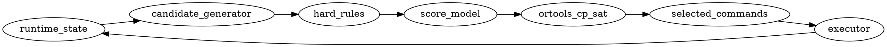

# Whiteout Survival Bot — Optimizer UI Specification

## Цель UI

UI нужен не просто для просмотра героев, а для объяснения решений optimizer-а.

Главная задача интерфейса:

> Показать, какие команды получит бот, почему именно эти команды выбраны, сколько ресурсов они потратят и какие альтернативы были отклонены.

Пример того, что пользователь должен видеть:

```text
1. Bahiti: level 1 → 2
2. Sergey: level 2 → 3
3. Bahiti: level 2 → 3
4. Jessie: expedition skill 1 level 4 → 5
5. Molly: level 8 → 9
```

При этом рядом должно быть видно:

```text
- cost
- score
- reason
- affected resource
- selected / rejected
- blocked by hard rule
```

---

## Роль Streamlit UI

Streamlit UI должен быть **debug/control panel**, а не частью core optimizer-а.

Правильное разделение:

```text
optimizer process
  reads runtime_state.yaml
  generates candidates
  scores candidates
  solves with OR-Tools
  writes solver_result.yaml

streamlit ui
  reads solver_result.yaml
  renders decision
  optionally triggers dry-run / approve command
```

UI не должен сам принимать решения. Он только показывает результат работы optimizer-а и даёт оператору возможность подтвердить выполнение.

---

## Основные вкладки UI

```text
1. Dashboard
2. Command Queue
3. Next Command
4. Candidates
5. Resources
6. Score Breakdown
7. Constraints
8. Raw YAML / JSON
```

---

# 1. Dashboard

## Назначение

Показать общее состояние optimizer-а.

## Что отображать

```text
Solver status
Objective value
Selected commands count
Rejected commands count
Available resources
Estimated spend
Current profile
Current generation
```

## Пример карточек

```text
Solver status: OPTIMAL
Objective value: 18700
Selected commands: 5
Rejected commands: 12
Profile: f2p_bear_and_growth
Generation: 1
```

## Streamlit элементы

```python
col1, col2, col3, col4 = st.columns(4)

col1.metric("Solver status", status)
col2.metric("Objective value", objective_value)
col3.metric("Selected commands", selected_count)
col4.metric("Rejected commands", rejected_count)
```

---

# 2. Command Queue

## Назначение

Главная вкладка UI.

Показывает итоговый список команд, которые получит бот.

Важно: это не просто выбранные candidates, а уже человекочитаемые и executor-ready команды.

## Пример таблицы

| # | Command | Hero | From | To | Cost | Score | Reason | Status |
|---:|---|---|---|---|---:|---:|---|---|
| 1 | level_up | Bahiti | level 1 | level 2 | 1200 XP | 5200 | active core marksman | pending |
| 2 | level_up | Sergey | level 2 | level 3 | 1500 XP | 4700 | early tank needed | pending |
| 3 | level_up | Bahiti | level 2 | level 3 | 1600 XP | 4600 | high ROI | pending |
| 4 | skill_up | Jessie | skill 1 lvl 4 | skill 1 lvl 5 | 10 manuals | 6400 | bear joiner threshold | pending |

## YAML формат

```yaml
execution_plan:
  mode: preview
  horizon: 5
  commands:
    - order: 1
      id: bahiti_level_1_to_2
      type: hero_upgrade
      action: level_up
      hero: bahiti
      from:
        level: 1
      to:
        level: 2
      cost:
        hero_xp: 1200
      score: 5200
      reasons:
        - active_core_marksman
        - affordable
        - best_roi_for_hero_xp
      status: pending

    - order: 2
      id: sergey_level_2_to_3
      type: hero_upgrade
      action: level_up
      hero: sergey
      from:
        level: 2
      to:
        level: 3
      cost:
        hero_xp: 1500
      score: 4700
      reasons:
        - early_tank_needed
        - active_lineup
      status: pending

    - order: 3
      id: bahiti_level_2_to_3
      type: hero_upgrade
      action: level_up
      hero: bahiti
      from:
        level: 2
      to:
        level: 3
      cost:
        hero_xp: 1600
      score: 4600
      reasons:
        - active_core_marksman
        - still_affordable
      status: pending
```

## Важный принцип

Execution Plan может быть двух видов:

```yaml
decision_mode:
  next_command:
    safe_for_execution: true

  preview_plan:
    horizon: 5
    safe_for_execution: false
    note: simulated_plan_can_change_after_real_execution
```

### Почему так

Оптимальный безопасный режим:

```text
solve
  ↓
execute 1 command
  ↓
refresh state/resources
  ↓
solve again
```

То есть длинный список команд лучше показывать как **preview**, а выполнять только первую команду после подтверждения.

---

# 3. Next Command

## Назначение

Показывает одну следующую команду, которую бот может выполнить прямо сейчас.

## Пример UI

```text
Next command

Upgrade Bahiti level 1 → 2

Cost:
- 1200 Hero XP

Why:
- Bahiti is active marksman
- Command is affordable
- Better score than Sergey for current resources

Risk:
- Low
```

## YAML формат

```yaml
next_command:
  id: bahiti_level_1_to_2
  executable: true
  command:
    type: hero_upgrade
    action: level_up
    hero: bahiti
    target:
      level: 2
  from:
    level: 1
  to:
    level: 2
  cost:
    hero_xp: 1200
  score: 5200
  reasons:
    - active_core_marksman
    - affordable
    - best_roi_for_hero_xp
  risks:
    - low_replacement_risk
```

## Streamlit элементы

```python
st.subheader("Next Command")

st.info("Upgrade Bahiti level 1 → 2")

col_a, col_b = st.columns(2)

with col_a:
    st.button("Dry run", type="secondary")

with col_b:
    st.button("Approve execution", type="primary")
```

---

# 4. Candidates

## Назначение

Показывает все возможные upgrade-команды, которые были рассмотрены solver-ом.

Это нужно для дебага:

```text
Почему бот выбрал Bahiti, а не Molly?
Почему Sergey был отклонён?
Почему Jessie skill имеет высокий score?
```

## Таблица

| ID | Hero | Action | From | To | Cost | Score | Selected | Reason |
|---|---|---|---|---|---:|---:|---|---|
| bahiti_level_1_to_2 | Bahiti | level_up | 1 | 2 | 1200 XP | 5200 | yes | active core |
| sergey_star_next | Sergey | star_tier_up | 2.0 | 2.1 | 5 shards | 1800 | no | low ROI |
| jessie_skill_1_4_to_5 | Jessie | skill_up | 4 | 5 | 10 manuals | 6400 | yes | bear threshold |
| zinman_level_next | Zinman | level_up | 1 | 2 | 1200 XP | 300 | no | low value |

## Candidate schema

```yaml
candidates:
  - id: jessie_expedition_skill_1_4_to_5
    action: skill_up
    hero: jessie
    from:
      expedition_skill_1: 4
    to:
      expedition_skill_1: 5
    costs:
      epic_expedition_manual: 10
    score:
      final: 6400
    selected: true
    reasons:
      - bear_joiner_threshold
      - high_bear_value
      - affordable

  - id: sergey_star_2_0_to_2_1
    action: star_tier_up
    hero: sergey
    from:
      star_level: 2
      star_tier: 0
    to:
      star_level: 2
      star_tier: 1
    costs:
      sergey_shards: 5
    score:
      final: 1800
    selected: false
    rejected_reason:
      - low_roi
      - replacement_risk
```

## Streamlit элементы

```python
event = st.dataframe(
    candidates_df,
    hide_index=True,
    width="stretch",
    on_select="rerun",
    selection_mode="single-row",
    column_config={
        "score_pct": st.column_config.ProgressColumn(
            "Score",
            min_value=0,
            max_value=1,
            format="%.2f",
        ),
        "costs": st.column_config.JsonColumn("Costs"),
    },
)
```

---

# 5. Resources

## Назначение

Показывает, какие ресурсы есть и сколько optimizer хочет потратить.

## Таблица

| Resource | Available | Selected Spend | Reserve | Remaining | Usage |
|---|---:|---:|---:|---:|---:|
| hero_xp | 120000 | 25300 | 0 | 94700 | 21% |
| epic_expedition_manual | 14 | 10 | 0 | 4 | 71% |
| gems | 18000 | 0 | 13500 | 18000 | 0% |
| mythic_general_shards | 10 | 0 | 10 | 10 | 0% |

## Resource schema

```yaml
resources:
  hero_xp:
    available: 120000
    selected_spend: 25300
    reserve: 0
    remaining: 94700

  epic_expedition_manual:
    available: 14
    selected_spend: 10
    reserve: 0
    remaining: 4

  gems:
    available: 18000
    selected_spend: 0
    reserve: 13500
    remaining: 18000

  mythic_general_shards:
    available: 10
    selected_spend: 0
    reserve: 10
    remaining: 10
```

## Streamlit элементы

```python
st.dataframe(
    resources_df,
    hide_index=True,
    width="stretch",
    column_config={
        "usage_pct": st.column_config.ProgressColumn(
            "Usage",
            min_value=0,
            max_value=1,
            format="%.0f%%",
        ),
    },
)
```

---

# 6. Score Breakdown

## Назначение

Показывает, из чего собран score команды.

Важно видеть не только `final_score`, но и компоненты.

## Пример

```yaml
score_breakdown:
  jessie_expedition_skill_1_4_to_5:
    bear_join: 5000
    threshold_bonus: 3000
    arena: 400
    exploration: 200
    replacement_penalty: 0
    resource_rarity_penalty: -800
    final: 6400
```

## UI

| Component | Value |
|---|---:|
| bear_join | 5000 |
| threshold_bonus | 3000 |
| arena | 400 |
| exploration | 200 |
| replacement_penalty | 0 |
| resource_rarity_penalty | -800 |
| final | 6400 |

## Streamlit элементы

```python
command_id = st.selectbox("Command", selected_command_ids)

breakdown = result["score_breakdown"].get(command_id, {})

score_df = pd.DataFrame(
    [{"component": k, "value": v} for k, v in breakdown.items()]
)

st.bar_chart(score_df, x="component", y="value")
st.dataframe(score_df, hide_index=True, width="stretch")
```

---

# 7. Constraints

## Назначение

Показывает hard rules и причины блокировки команд.

Hard rules не должны быть частью score. Если команда запрещена, она должна быть удалена до solver-а или зафиксирована как `x = 0`.

## Примеры hard constraints

```yaml
hard_constraints:
  - id: deny_mythic_general_shards_gen1_default
    type: deny_resource_usage
    resource: mythic_general_shards
    deny_if:
      hero_generation: 1
      hero_not_in:
        - molly

  - id: stop_sergey_after_flint
    type: deny_actions
    hero: sergey
    actions:
      - star_tier_up
      - gear_enhance
      - exclusive_gear_up
    when:
      hero_unlocked: flint

  - id: support_level_cap
    type: cap_level
    heroes:
      - jessie
      - jasser
      - patrick
      - seo_yoon
    max_level_before_drill: 40

  - id: reserve_gems_for_wheel
    type: spendable_capacity
    resource: gems
    reserve_floor: 13500
```

## Rejected commands

| Command | Hero | Action | Reason |
|---|---|---|---|
| sergey_star_next | Sergey | star_tier_up | blocked_by_replacement_rule |
| zinman_level_next | Zinman | level_up | low_score |
| bahiti_general_shards | Bahiti | star_tier_up | mythic_general_shards_protected |

## Dependency graph

Можно использовать `st.graphviz_chart`.



---

# 8. Raw YAML / JSON

## Назначение

Показывает raw output optimizer-а для дебага.

## Что отображать

```text
runtime_state.yaml
solver_result.yaml
execution_plan.yaml
selected_commands.yaml
```

## Streamlit элементы

```python
with st.expander("Raw solver result"):
    st.json(result)

with st.expander("Execution plan YAML"):
    st.code(yaml.safe_dump(execution_plan), language="yaml")
```

---

# Итоговый solver_result.yaml

UI должен читать примерно такой файл:

```yaml
solver_result:
  status: OPTIMAL
  objective_value: 18700
  profile: f2p_bear_and_growth
  generation: 1

next_command:
  id: bahiti_level_1_to_2
  executable: true
  command:
    type: hero_upgrade
    action: level_up
    hero: bahiti
    target:
      level: 2
  from:
    level: 1
  to:
    level: 2
  cost:
    hero_xp: 1200
  score: 5200
  reasons:
    - active_core_marksman
    - affordable
    - best_roi_for_hero_xp

execution_plan:
  mode: preview
  horizon: 5
  commands:
    - order: 1
      id: bahiti_level_1_to_2
      type: hero_upgrade
      action: level_up
      hero: bahiti
      from:
        level: 1
      to:
        level: 2
      cost:
        hero_xp: 1200
      score: 5200
      reasons:
        - active_core_marksman
        - affordable
      status: pending

    - order: 2
      id: sergey_level_2_to_3
      type: hero_upgrade
      action: level_up
      hero: sergey
      from:
        level: 2
      to:
        level: 3
      cost:
        hero_xp: 1500
      score: 4700
      reasons:
        - early_tank_needed
        - active_lineup
      status: pending

    - order: 3
      id: bahiti_level_2_to_3
      type: hero_upgrade
      action: level_up
      hero: bahiti
      from:
        level: 2
      to:
        level: 3
      cost:
        hero_xp: 1600
      score: 4600
      reasons:
        - active_core_marksman
        - still_affordable
      status: pending

selected:
  - id: bahiti_level_1_to_2
    hero: bahiti
    action: level_up
    score: 5200
    costs:
      hero_xp: 1200
    reasons:
      - active_core_marksman
      - affordable

  - id: jessie_expedition_skill_1_4_to_5
    hero: jessie
    action: skill_up
    score: 6400
    costs:
      epic_expedition_manual: 10
    reasons:
      - bear_joiner_threshold
      - high_bear_value

rejected:
  - id: sergey_star_next
    hero: sergey
    action: star_tier_up
    score: 1800
    costs:
      sergey_shards: 5
    reason:
      - low_roi
      - replacement_risk

resources:
  hero_xp:
    available: 120000
    selected_spend: 25300
    reserve: 0
    remaining: 94700

  epic_expedition_manual:
    available: 14
    selected_spend: 10
    reserve: 0
    remaining: 4

  gems:
    available: 18000
    selected_spend: 0
    reserve: 13500
    remaining: 18000

score_breakdown:
  bahiti_level_1_to_2:
    core_team: 2500
    marksman_value: 1800
    affordability_bonus: 700
    resource_penalty: -300
    final: 5200

  jessie_expedition_skill_1_4_to_5:
    bear_join: 5000
    threshold_bonus: 3000
    resource_penalty: -800
    final: 6400
```

---

# Streamlit app skeleton

```python
import yaml
import pandas as pd
import streamlit as st

st.set_page_config(
    page_title="WOS Hero Optimizer",
    layout="wide",
)

st.title("Whiteout Survival Hero Optimizer")


def load_yaml(path: str) -> dict:
    with open(path, "r") as f:
        return yaml.safe_load(f)


def flatten_execution_plan(result: dict) -> pd.DataFrame:
    commands = result.get("execution_plan", {}).get("commands", [])

    rows = []

    for cmd in commands:
        cost = cmd.get("cost", {})
        reasons = cmd.get("reasons", [])

        rows.append({
            "order": cmd.get("order"),
            "id": cmd.get("id"),
            "hero": cmd.get("hero"),
            "action": cmd.get("action"),
            "from": cmd.get("from"),
            "to": cmd.get("to"),
            "cost": cost,
            "total_cost": sum(cost.values()) if cost else 0,
            "score": cmd.get("score", 0),
            "reason": ", ".join(reasons),
            "status": cmd.get("status", "pending"),
        })

    return pd.DataFrame(rows)


def flatten_candidates(result: dict) -> pd.DataFrame:
    rows = []

    for cmd in result.get("selected", []):
        rows.append({
            "id": cmd.get("id"),
            "hero": cmd.get("hero"),
            "action": cmd.get("action"),
            "status": "selected",
            "score": cmd.get("score", 0),
            "costs": cmd.get("costs", {}),
            "reason": ", ".join(cmd.get("reasons", [])),
        })

    for cmd in result.get("rejected", []):
        reason = cmd.get("reason", "")
        if isinstance(reason, list):
            reason = ", ".join(reason)

        rows.append({
            "id": cmd.get("id"),
            "hero": cmd.get("hero"),
            "action": cmd.get("action"),
            "status": "rejected",
            "score": cmd.get("score", 0),
            "costs": cmd.get("costs", {}),
            "reason": reason,
        })

    df = pd.DataFrame(rows)

    if not df.empty:
        max_score = max(df["score"].max(), 1)
        df["score_pct"] = df["score"] / max_score

    return df


def flatten_resources(result: dict) -> pd.DataFrame:
    rows = []

    for name, item in result.get("resources", {}).items():
        available = item.get("available", 0)
        spend = item.get("selected_spend", 0)
        reserve = item.get("reserve", 0)
        remaining = item.get("remaining", available - spend)

        rows.append({
            "resource": name,
            "available": available,
            "selected_spend": spend,
            "reserve": reserve,
            "remaining": remaining,
            "usage_pct": spend / available if available else 0,
        })

    return pd.DataFrame(rows)


result = load_yaml("solver_result.yaml")

solver = result.get("solver_result", {})
status = solver.get("status", "UNKNOWN")
objective_value = solver.get("objective_value", 0)
profile = solver.get("profile", "unknown")
generation = solver.get("generation", "unknown")

execution_df = flatten_execution_plan(result)
candidates_df = flatten_candidates(result)
resources_df = flatten_resources(result)

selected_count = len(result.get("selected", []))
rejected_count = len(result.get("rejected", []))

col1, col2, col3, col4, col5 = st.columns(5)

col1.metric("Solver", status)
col2.metric("Objective", objective_value)
col3.metric("Selected", selected_count)
col4.metric("Rejected", rejected_count)
col5.metric("Profile", profile)

tabs = st.tabs([
    "Dashboard",
    "Command Queue",
    "Next Command",
    "Candidates",
    "Resources",
    "Score Breakdown",
    "Constraints",
    "Raw",
])

with tabs[0]:
    st.subheader("Overview")
    st.write(f"Generation: `{generation}`")
    st.write(f"Profile: `{profile}`")

    st.subheader("Selected commands")
    st.dataframe(execution_df, hide_index=True, width="stretch")

with tabs[1]:
    st.subheader("Command Queue / Execution Plan")

    st.dataframe(
        execution_df,
        hide_index=True,
        width="stretch",
        column_config={
            "cost": st.column_config.JsonColumn("Cost"),
            "from": st.column_config.JsonColumn("From"),
            "to": st.column_config.JsonColumn("To"),
        },
    )

with tabs[2]:
    st.subheader("Next Command")

    next_command = result.get("next_command")

    if next_command:
        st.info(
            f"{next_command['command']['action']} "
            f"{next_command['command']['hero']}"
        )

        st.json(next_command)

        col_a, col_b = st.columns(2)

        with col_a:
            st.button("Dry run", type="secondary")

        with col_b:
            st.button("Approve execution", type="primary")
    else:
        st.warning("No executable next command.")

with tabs[3]:
    st.subheader("Candidates")

    event = st.dataframe(
        candidates_df,
        hide_index=True,
        width="stretch",
        on_select="rerun",
        selection_mode="single-row",
        column_config={
            "score_pct": st.column_config.ProgressColumn(
                "Score %",
                min_value=0,
                max_value=1,
                format="%.2f",
            ),
            "costs": st.column_config.JsonColumn("Costs"),
        },
    )

    if event.selection.rows:
        row = candidates_df.iloc[event.selection.rows[0]]
        st.divider()
        st.subheader("Candidate details")
        st.json(row.to_dict())

with tabs[4]:
    st.subheader("Resources")

    st.dataframe(
        resources_df,
        hide_index=True,
        width="stretch",
        column_config={
            "usage_pct": st.column_config.ProgressColumn(
                "Usage",
                min_value=0,
                max_value=1,
                format="%.0f%%",
            ),
        },
    )

with tabs[5]:
    st.subheader("Score Breakdown")

    breakdown = result.get("score_breakdown", {})

    if breakdown:
        command_id = st.selectbox("Command", list(breakdown.keys()))
        values = breakdown.get(command_id, {})

        score_df = pd.DataFrame(
            [{"component": k, "value": v} for k, v in values.items()]
        )

        st.bar_chart(score_df, x="component", y="value")
        st.dataframe(score_df, hide_index=True, width="stretch")
    else:
        st.warning("No score breakdown available.")

with tabs[6]:
    st.subheader("Rejected commands")

    rejected_df = candidates_df[candidates_df["status"] == "rejected"]

    st.dataframe(
        rejected_df,
        hide_index=True,
        width="stretch",
    )

    st.subheader("Pipeline graph")

    graph = '''
    digraph {
      rankdir=LR;

      "runtime_state" -> "candidate_generator";
      "candidate_generator" -> "hard_rules";
      "hard_rules" -> "score_model";
      "score_model" -> "ortools_cp_sat";
      "ortools_cp_sat" -> "selected_commands";
      "selected_commands" -> "executor";
      "executor" -> "runtime_state";
    }
    '''

    st.graphviz_chart(graph, width="stretch")

with tabs[7]:
    st.subheader("Raw solver result")
    st.json(result)

    st.subheader("Raw YAML")
    st.code(yaml.safe_dump(result, sort_keys=False), language="yaml")
```

---

# MVP для UI

Минимально полезная первая версия:

```text
1. Command Queue
2. Next Command
3. Candidates
4. Resources
5. Score Breakdown
```

Остальное можно добавить позже.

---

# Главное правило UI

UI должен отвечать на 3 вопроса:

```text
1. Что бот сделает сейчас?
2. Почему он выбрал именно это?
3. Почему он не выбрал остальные варианты?
```

Если UI отвечает на эти вопросы — он уже полезен.
